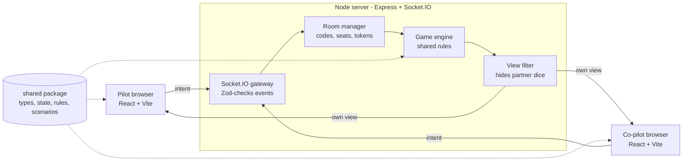

# Sky Team Online — Build Plan

Sep 28, 2026 · exported from the Claude doc (the live version may be newer)

## Overview

Build an online, 2-player version of Sky Team where the Node server is the referee: it holds the real game state, validates every move, and sends each player only what they may see.

**Scope for v1:** room codes, pilot/co-pilot seats, the base airport scenario, dice placement on all cockpit systems, coffee tokens, win/crash detection, reconnection, and a responsive UI for phones, tablets and desktop. Extra airports and modules come next; the public deploy is the last phase (Phase 10).

**Key principle:** never trust the client. The browser only sends intents ("place die 2 on the axis slot"); the server checks the rules and broadcasts the result.

| Layer | Choice | Why |
| --- | --- | --- |
| Language | TypeScript (strict) everywhere | Shared types catch rule and protocol bugs |
| Monorepo | pnpm workspaces | One repo, `shared` imported by both sides |
| Server | Node 20+, Express, Socket.IO | Rooms, acks and reconnection built in |
| Client | React + Vite | Fast dev server, simple static build; Tailwind CSS v4 for styling |
| UI components | shadcn/ui (lobby, dialogs, toasts only) | Accessible pieces copied into the repo; the board stays custom |
| Client state | Zustand (or React context) | Holds the latest server view, nothing else |
| Validation | Zod | Checks every incoming socket payload |
| Unit/integration tests | Vitest | Same runner for shared, server and client |
| Component tests | React Testing Library | Board and dice tray behaviour |
| E2E tests | Playwright | Two browser contexts = two real players |
| Hosting | Render, Railway or Fly.io | Long-running Node process with WebSockets |

This is a personal/learning project: if it is ever published, use an original name and artwork rather than the publisher's.

## Architecture

One Node process serves the built React app and runs Socket.IO; both sides import the same `shared` package so rules are written once.



Each move flows through the server, then each player receives their own filtered view.

```
sky-team/
├── package.json            # pnpm workspaces root
├── pnpm-workspace.yaml
├── tsconfig.base.json
├── packages/
│   ├── shared/
│   │   └── src/
│   │       ├── types.ts        # GameState, Seat, Slot, events
│   │       ├── state.ts        # createGame()
│   │       ├── rules.ts        # canPlaceDie, placeDie, endRound, checkLanding
│   │       ├── views.ts        # viewFor(state, seat)
│   │       ├── scenarios.ts    # airport configs as data
│   │       └── rng.ts          # seedable dice roller
│   ├── server/
│   │   └── src/
│   │       ├── index.ts        # Express + Socket.IO bootstrap
│   │       ├── rooms.ts        # create/join/leave, cleanup
│   │       ├── handlers.ts     # socket event handlers
│   │       └── schemas.ts      # Zod payload schemas
│   └── client/
│       └── src/
│           ├── main.tsx
│           ├── socket.ts       # typed socket instance
│           ├── store.ts        # Zustand store for the view
│           ├── api.ts          # socket events → store; actions (create, join, place, …)
│           ├── session.ts      # saved seat token, invite links
│           ├── screens/        # Lobby (+ waiting room), Game
│           ├── components/     # Cockpit, Slot, DiceTray, StatusBar, GameOverDialog
│           │                   # (+ components/ui from shadcn)
│           └── svgs/           # one SVG drawing per file: DieFace, AxisDial, SpeedGauge,
│                               # AltitudeTrack, ApproachTrack, Plane, Switch
├── e2e/                        # Playwright tests
└── .github/workflows/ci.yml
```

## Game state and rules

The whole game is one serialisable `GameState` object plus pure functions that return a new state; no rule lives in React or in socket handlers.

Implemented in Phase 1 (`packages/shared/src`):

| File | Contents |
| --- | --- |
| `types.ts` | `Seat`, `SlotId`, `Phase` (`strategy` → `placing` → … → `won` / `lost`), `EndReason`, `Scenario`, `PlaceIntent`, `GameEvent`, `GameState` |
| `slots.ts` | Every slot's seat colours, allowed values and group; the 4 mandatory slots |
| `scenarios.ts` | Altitude track and YUL scenario as data |
| `state.ts` | `createGame(scenario, seed)` |
| `rules.ts` | `rollDice`, `canPlaceDie`, `placeDie`, `legalMoves`, `resolveRound`, `checkLanding`, `spendReroll`, `rerollDice` |
| `rng.ts` | mulberry32; `rngSeed` + `rngState` live in the state, so `rngSeed` + `log` replay a game |
| `views.ts` | `PlayerView`, `viewFor(state, seat)`, and `canPlaceInView` (the client’s `canPlaceDie`: the same `checkPlacement`, read from the view) |
| `events.ts` | Socket.IO protocol types (see below) |
| `random-play.ts` | Random agent (`createRandomAgent`, `applyAgentAction`) and `playRandomGame`, imported as `@sky/shared/random-play`; used by fuzzing, the socket full-game test and `pnpm --filter @sky/shared random-play` |

Rule functions are pure (they return a new state). `canPlaceDie(state, seat, { dieId, slot, coffeeDelta })` returns `{ ok: true }` or `{ ok: false, reason }`; `placeDie` throws `RuleError` on an illegal move. Axis and engines resolve **as soon as the second die is placed** (as the rulebook says); `placeDie` ends the round by itself once nobody can place another die.

**Base-game numbers (checked against the rulebook and the physical board):**

| Rule | Value |
| --- | --- |
| Axis | Tilts toward the higher die by the difference; not reset between rounds; lose on reaching 3 marks either way |
| Aerodynamics | Blue starts between 4–5 (+1 per landing gear, 7–8 when all down); orange between 8–9 (+1 per flap, just past 12) |
| Speed | ≤ blue: 0 spaces; ≤ orange: 1 space; above: 2 spaces. Final round: compared with brakes instead |
| Landing gear | 1/2, 3/4, 5/6, any order |
| Flaps | 1/2, 2/3, 4/5, 5/6, in order |
| Brakes | 2, then 4, then 6; marker starts left of 2; landing needs speed below the marker |
| Radio | Pilot 1 space, co-pilot 2; die value N removes a plane N−1 spaces ahead of the current position |
| Coffee | +1 per concentration die, max 3, shared; each token ±1, no wrap past 1 or 6 |
| Altitude | 7 rounds, 6000 → 0; first player alternates (pilot at 6000); reroll tokens at 6000 and 2000 |
| Collision / overshoot | Advancing with planes in the current position, or from the airport, loses |

**Optional round timer** (not in the board game; an online extra): the game creator can turn on a timer in the lobby (off by default). From the roll until the round's last die is placed the players have `ROUND_TIMER_MS` (3 minutes); if it runs out, the game is lost (`endReason: 'time-up'`). `GameState.timerMs` holds the setting and `deadline` the running round's end; `startRoundTimer(state, now)` starts it after `rollDice`, `expireRoundTimer(state, now)` ends the game once `now` reaches the deadline, and ending the round or the game clears it. The server keeps one timeout per room (`syncRoundTimer`) and also checks the deadline before every move, so a late move finds the game already lost. Views carry `timerMs` and `roundTimeLeftMs` (relative, so a wrong device clock does not matter).

**Assumptions to revisit:**

- If the seat on turn has no legal placement, the turn passes to the partner; if neither can place, the leftover dice are lost and the round ends (the rulebook does not cover this).
- Placing on a flap or brake that is already deployed is allowed and has no effect (the rulebook says so for landing gear).

## Socket.IO protocol

All events are typed once in `shared` and used by both `Server<...>` and `Socket<...>`, so a renamed event breaks the build instead of the game.

| Direction | Event | Payload | Server response |
| --- | --- | --- | --- |
| Client → Server | `room:create` | `{ name, timer? }` (`timer: true` for a timed game) | ack `{ ok, code, seat, token }` |
| Client → Server | `room:join` | `{ code, name }` | ack `{ ok, code, seat, token }` or `{ ok:false, error }` |
| Client → Server | `room:rejoin` | `{ code, token }` | ack + fresh `game:view` |
| Client → Server | `room:leave` | `{}` | ack; seat freed, partner's game restarts; empty room deleted |
| Client → Server | `game:ready` | `{}` | ack; rolls dice when both are ready |
| Client → Server | `game:place` | `{ dieId, slot, coffeeDelta }` | ack `{ ok }` or `{ ok:false, error }` (rule reason, e.g. `not-your-turn`) |
| Client → Server | `game:spend-reroll` | `{}` | ack; both players may then reroll once |
| Client → Server | `game:reroll` | `{ dieIds }` | ack; rerolls your chosen dice (may be none) |
| Client → Server | `game:rematch` | `{}` | ack; new game, same room and seats; `game-not-over` otherwise |
| Server → Client | `game:view` | `PlayerView` | to each seat after every change |
| Server → Client | `room:presence` | `{ pilot, copilot }`: `{ name, online, ready }` or `null` | on join/leave/ready/every change |

Every ack is `{ ok: true }` or `{ ok: false, error }`, where `error` is a room error (`bad-request`, `not-in-room`, `game-not-over`, `too-many-rooms`, …) or the `MoveError` from the shared rules. Types live in `packages/shared/src/events.ts` (`ClientToServer`, `ServerToClient`).

**Hidden information.** `viewFor(state, seat)` is the only way state leaves the server:

- Your own unplaced dice: full values.
- Partner's unplaced dice: a count only (`partnerDiceLeft: 3`).
- Placed dice, tracks, coffee, altitude: public.
- `rngSeed` and the log's future rolls: never sent.

**No-talking rule.** There is no in-game chat (removed Sep 28, 2026): players talk outside the app (in person or a call) during the `strategy` phase, and each presses "Ready to roll" when the discussion is over. From the roll until the round ends they stay silent by agreement, as at the table.

**Server handler pattern** (`onSeated` in `handlers.ts`): parse payload with Zod → find the socket's seat → `canPlaceDie` → `placeDie` (which resolves axis, engines, the end of the round and landing) → `broadcastRoom` sends presence and each seat's `viewFor`. Any failure returns `{ ok:false, error }` and changes nothing.

## Responsive UI (mobile web)

Design mobile-first: a phone in portrait (360–430 px wide) is the hardest screen, so build it first and let larger screens spread the same components out.

```
Phone portrait (< 600 px)        Desktop (>= 1024 px, centred container, max 72rem)
+----------------------+            +--------------------------------------+
| Status bar           |            | Status bar                           |
+----------------------+            +--------------------------------------+
| Tracks strip         |            |   Altitude track   Approach track    |
+----------------------+            +--------------------------------------+
| Cockpit panel        |            | Cockpit board (panels in 3 columns,  |
| (scrolls; your slots |            | scrolls)                             |
|  first)              |            +--------------------------------------+
+----------------------+            | Dice tray                            |
| Dice tray (fixed)    |            +--------------------------------------+
+----------------------+
```

The same React components rearrange through CSS Grid areas; only the layout changes, never the game logic. Set the widths below as custom Tailwind breakpoints in `@theme` (tablet at 600px, desktop at 1024px) and write mobile-first classes, e.g. `grid-cols-1 tablet:grid-cols-2 desktop:grid-cols-3`.

| Screen | Width | Layout |
| --- | --- | --- |
| Phone portrait | under 600 px | Stacked: status bar, tracks strip, scrolling cockpit, dice tray fixed at bottom |
| Phone landscape / tablet | 600–1023 px | Two columns: tracks + cockpit left, dice tray right |
| Desktop | 1024 px and up | One centred container (max 72rem): status bar, both tracks side by side, cockpit board, dice tray. In the cockpit, equal 16% side columns: pilot radio above landing gear on the left (switch right of each slot), co-pilot radio above flaps on the right (switch left of each slot); axis, engines, brakes and concentration in the centre |

**Layout and styling**

- Tailwind CSS v4, with design tokens (colors, spacing, fonts) defined once in `@theme`, so they work as utility classes and as CSS variables for the SVG board. Keep long class lists readable by extracting small components (Slot, Die, Panel) rather than using `@apply` everywhere.
- shadcn/ui for the lobby (Button, Input, Card), Dialog, toasts, Tooltip/Popover, Select/Tabs. Build the cockpit, dice, tracks and alarm board yourself.
- CSS Grid with named `grid-template-areas` per breakpoint; container queries for the cockpit so it adapts to its column, not the window.
- Draw the gauges, dice and tracks as SVG with a `viewBox` so they scale without blurring; slots are real buttons so they stay accessible and easy to tap.
- Use `100dvh` (not `100vh`) and `env(safe-area-inset-*)` so the dice tray clears the iPhone home bar and notches.

**Touch interaction**

- Tap a die, then tap a slot. No drag-and-drop required; add drag on desktop later as an extra.
- Touch targets at least 44 × 44 px; dice and slots never smaller.
- Coffee ± appears as large buttons next to the selected die.
- `touch-action: manipulation` to stop double-tap zoom; inputs at 16 px or more so iOS does not zoom on focus.
- No hover-only information: anything shown on hover also shows on tap.
- Clear turn feedback: a banner plus optional `navigator.vibrate` on Android when it becomes your turn.

**Mobile browser behaviour**

- Phones pause sockets when the tab is in the background: on `visibilitychange` back to visible, reconnect and send `room:rejoin` with the saved token.
- Optional Screen Wake Lock during a game so the phone does not sleep mid-round.
- Share the room link with the Web Share API (`navigator.share`), falling back to copy-to-clipboard.
- Optional PWA manifest and icon so players can add the game to their home screen.
- Keep the bundle small (code-split the lobby and game screens) for slow mobile networks.

## Build phases

Eleven phases, each ending in something you can run; do not start networking until Phase 1's tests pass.

### Phase 0: Project setup

- [x] Create the pnpm workspace with `shared`, `server`, `client` packages
- [x] `tsconfig.base.json` with `strict: true`, path aliases for `@sky/shared`
- [x] Tailwind CSS v4 in the client via the `@tailwindcss/vite` plugin; ESLint + Prettier (with the Tailwind class-sorting plugin), Vitest at the root
- [x] shadcn/ui init in `packages/client` (`@/` alias), add components only as needed
- [x] Scripts: `dev` (server + Vite together via `concurrently`), `build`, `test`, `e2e`
- [x] Add a CI workflow (`.github/workflows/ci.yml`: typecheck, lint, format check, test, build)
- [x] Push to GitHub (`origin` = `thawmisntme4081/boardgame`)

**Done when:** `pnpm dev` starts both apps and `pnpm test` runs an empty suite. ✅ Verified Sep 28, 2026.

Setup notes: pnpm 12 via corepack (esbuild approved in `allowBuilds`); TypeScript pinned to 6.0 because typescript-eslint does not support TS 7 yet; shadcn uses the Radix base with the Nova preset (`cn` package in place of clsx + tailwind-merge); Vite proxies `/health` and `/socket.io` to the server on port 3000.

### Phase 1: Core rules in `shared`

- [x] Types for state, slots, dice, events
- [x] Seedable RNG and `createGame`
- [x] `canPlaceDie` / `placeDie` for every slot type
- [x] Coffee: earn on concentration, spend for ±1
- [x] `resolveRound`: axis, speed from engines vs aero markers, approach movement, altitude
- [x] Crash checks: axis out of range, moving into planes, overshooting, missing the airport, empty mandatory spaces
- [x] `checkLanding` win conditions
- [x] Reroll tokens (spend one, then both players may reroll once)
- [x] Script that plays random legal moves to the end, 1,000 times (`pnpm --filter @sky/shared random-play`, plus a fast-check fuzz test)
- [x] Replace the placeholder YUL approach track with the real plane counts

**Done when:** unit tests cover every rule and the random-play script never throws. ✅ Verified Sep 28, 2026: 69 tests pass, including 1,000 fuzzed games.

### Phase 2: Server and rooms

- [x] Express serves `/health`; Socket.IO attached to the same HTTP server (`app.ts` builds it unstarted so tests pick a random port)
- [x] Room manager: 4-letter codes (no I or O), creator = pilot, joiner = co-pilot, UUID reconnect tokens
- [x] Handlers for `room:create`, `room:join`, `game:ready` (dice roll when both players are ready), plus server-side `room:rejoin`
- [x] Zod schemas for every incoming payload; bad payloads, missing acks and handler errors answer `bad-request` without crashing
- [x] `viewFor` in `shared/views.ts` and the typed protocol in `shared/events.ts` (needed for `game:view`)

**Done when:** two socket clients in an integration test can join the same room and both receive a `game:view`. ✅ Verified Sep 28, 2026: 99 tests pass (30 new: rooms, schemas, `viewFor`, and Socket.IO integration tests against a real server).

### Phase 3: Gameplay over the wire

- [x] `game:place` handler using the shared rules (rule reasons returned in the ack; illegal moves change nothing)
- [x] `viewFor` filtering, emitted to each seat after every change
- [x] ~~Chat locked during `placing`~~ Built, then removed Sep 28, 2026 at your request: players talk outside the app
- [x] Round resolution and game over broadcast (every view carries `phase`, `endReason`, `landingFailures`)
- [x] Reroll events: `game:spend-reroll`, `game:reroll`
- [x] `game:rematch`: fresh game in the same room once the game is over (either player can start it)

**Done when:** a scripted two-client test plays a full game over sockets and no payload ever contains the partner's dice values. ✅ Verified Sep 28, 2026: 110 tests pass. `game.test.ts` drives the shared random agent over two real sockets (seed 1: 6 rounds, over 40 actions), checks the server state against an in-process game after every action, and checks every pair of views for leaked partner dice; a second test broadcasts a landing win.

Notes: the in-process vs. socket comparison found a `-0` coffee delta from `legalMoves` (JSON turns it into `0`); fixed in `rules.ts`. The careful random agent never wins on the real YUL track (0 wins in 3,000 games), so the win is tested from a prepared final round.

### Phase 4: React client

- [x] Typed socket singleton + Zustand store holding the latest `PlayerView` (plus UI-only state: selected die, draft coffee, reroll picks)
- [x] Mobile-first layout shell: CSS Grid areas for phone, tablet and desktop (`.game-grid` in `index.css`, using `@variant tablet/desktop`)
- [x] Lobby screen: create game, join by code, copy invite link (`/r/ABCD`), Web Share on phones; waiting room with the code
- [x] Board: axis, engines, radio, gear, flaps, brakes, concentration, altitude and approach tracks. Gauges and tracks are SVG with a `viewBox`; slots are 48 px buttons (accessible, easy to tap)
- [x] Dice tray: tap a die, then tap a slot; valid slots highlighted via the shared rules (`canPlaceInView`, same check as the server's `canPlaceDie`); the radio target shows on the approach track
- [x] Coffee ± control, turn indicator, round and altitude display, all with 44 px touch targets
- [x] ~~Strategy-phase chat panel~~ Built, then removed Sep 28, 2026 (no in-game chat)
- [x] Reconnect on `visibilitychange` when a phone brings the tab back (also on reload, from the saved session)
- [x] Game over screen with reason (every failed landing condition) and rematch
- [x] Reroll flow: spend a token, tick dice, reroll or keep all

**Done when:** two people on your LAN, one on a desktop and one on a phone in portrait, can finish the base scenario. ⏳ Automated check passed Sep 28, 2026: Playwright drove a desktop Chromium pilot and an iPhone 13 (emulated) co-pilot through lobby → invite link → strategy → placing → game over → rematch with no console errors, plus a tablet-size layout check. Sep 29: a full game also ran through the LAN address and through a public Cloudflare tunnel (desktop + emulated phone, reload mid-round, rematch; no errors). **Still to do by you:** one game on a real phone (`pnpm dev:lan`, then open the Network URL Vite prints).

Notes: `canPlaceDie` was split so the client runs the same check (`checkPlacement` takes a `PlacementContext`, which both `GameState` and `PlayerView` provide; a test compares both on 100,000+ moves). 131 tests pass, including React Testing Library tests for slots, dice tray, coffee, rerolls, game over and the lobby. The game screen is lazy-loaded (58 kB chunk since chat was removed).

### Phase 5: Robustness

- [x] Reconnect: token in `localStorage`, `room:rejoin` restores the seat (reload, reconnect, or a phone tab coming back)
- [x] Presence indicator when the partner drops: status bar dot, plus a message if they are still gone after 3 s ("lost connection", then "is back"); a quick refresh shows nothing
- [x] Idempotent moves: a repeated `game:place` for a die already placed on that slot is accepted and changes nothing; the client also never sends the same request twice while one is waiting; both players pressing "Fly again" starts one game
- [x] Room cleanup: rooms nobody is connected to are removed after 30 minutes without activity (swept every minute); at most 5 live rooms per creator IP (`too-many-rooms`)
- [x] Leaving mid-game: `room:leave` (Leave button with confirmation in the status bar) frees the seat; the partner is told, their game restarts and they wait for someone new; when both leave the room is deleted. Closing the tab only marks you offline.

**Done when:** refreshing either tab mid-round resumes the game exactly. ✅ Verified Sep 29, 2026: in Chromium (desktop + emulated iPhone 13), reloading each tab mid-round showed identical dice, placed dice, turn and round; plus drop/return and leave flows. 155 tests pass (server: rejoin mid-round, double taps, double rematch, leave, idle sweep, per-IP limit, client IP; client: partner messages, Leave confirmation).

### Phase 6: Tests and CI

- [x] Unit, property, integration and component suites (Vitest): 159 tests
- [x] Playwright E2E in `e2e/` against the production build (the server serves `client/dist`), on Desktop Chrome, iPhone 13 (WebKit) and Pixel 7: lobby, invite link, unknown code, a full game to a crash + "Fly again", a landing from a prepared final round, refreshing either tab mid-round, leaving and a newcomer joining, and one desktop + phone game
- [x] CI workflow: job `check` (typecheck, lint, format, Vitest, build) on every push to `main` and every PR; job `e2e` after it installs Chromium + WebKit and runs `pnpm e2e`, uploading the report on failure
- [x] Suites green in GitHub Actions (both jobs: `check`, and `e2e` with Playwright + Lighthouse), confirmed Sep 29, 2026
- [x] Lighthouse mobile audit in CI (`pnpm lighthouse`, `lighthouserc.cjs`): lobby and invite page on a throttled mid-range phone; fails below 90 accessibility or on small touch targets (`target-size`), warns below 80 performance / 90 best practices. Local run Sep 29: accessibility 100, best practices 100, touch targets pass, performance 87. `lhci` cannot clean up after itself on Windows (EPERM on its temp folder), so it runs in CI (Linux) only

**Done when:** unit, integration and Playwright suites are green in GitHub Actions. ✅ Verified Sep 29, 2026: both CI jobs green on GitHub; locally Vitest 159/159, Playwright 22/22 (three consecutive runs, 2 skips by design), Lighthouse mobile: accessibility 100, best practices 100, touch targets pass, performance 87.

E2E setup: `pnpm e2e` builds the app and starts `node packages/server/dist/index.js` on port 3100 with `GAME_SEED=1` (same dice every game, so runs repeat), `E2E_HOOKS=1` (a test-only `POST /__e2e/rooms/:code/game` that sets up a game state; used for the landing test, since a random win through the UI is unreliable) and `ROOMS_PER_IP=1000`. Both `GAME_SEED` and `E2E_HOOKS` are ignored when `NODE_ENV=production`.

### Phase 7: Base game airports and modules

v1 ships one airport; this phase fills in the rest of the base box and builds the module system the expansion needs.

- [ ] Module hook system: a scenario lists its active modules; each module adds its own state and hooks into rolling, `canPlaceDie`, `placeDie` and `resolveRound`
- [ ] Remaining base-box airports and scenarios as scenario data (11 airports, 21 scenarios)
- [ ] Base modules (wind, kerosene, traffic, ice, intern and the rest) as rule hooks, one at a time, each with tests
- [ ] Scenario picker in the lobby, with difficulty shown
- [ ] UI slots and tracks for each module, placed for phone and desktop layouts

**Done when:** every base scenario plays end to end and random-play fuzzing passes on all of them.

### Phase 8: Turbulence expansion

The Turbulence expansion ([publisher page](https://www.scorpionmasque.com/en/sky-team-turbulence)) adds 10 destinations, 20 harder scenarios and new modules including Turbulence, Low Visibility and Alarms; it needs Phase 7's module system.

- [ ] Read the expansion rulebook and list every new rule as a test case before coding
- [ ] Add the new approach and altitude tracks and the 20 scenarios as scenario data, tagged `expansion: 'turbulence'`
- [ ] Turbulence module as a rule hook
- [ ] Low Visibility module; if it hides information from players, extend `viewFor` so hidden values never leave the server
- [ ] Alarms module: alarm board state, alarm tokens, and blocked actions checked in `canPlaceDie`
- [ ] Scenario-specific extras (e.g. the Antarctica penguin tokens)
- [ ] UI: alarm board panel and new track art, fitting the phone bottom-sheet and desktop column layouts
- [ ] Lobby: "Turbulence" filter in the scenario picker; allow mixing expansion modules into base scenarios if the rulebook permits
- [ ] Tests: unit tests per module, one Playwright game per new module, fuzzing across all 41 scenarios

**Done when:** all 20 expansion scenarios play end to end on phone and desktop with tests green.

### Phase 9: Extras

- [ ] Redis or SQLite persistence so games survive restarts
- [x] Optional round timer (Sep 29, 2026): lobby switch (off by default), 3 minutes per round from the roll, countdown next to the turn label (red for the last 30 s), time up = game lost; enforced by the server; kept on rematch. Tests: shared rules, server (expiry for both players, late move refused, stopping when the last die is placed, rematch), client (lobby switch, countdown), Playwright (a timed game running out)
- [x] "Next turn in 5s" pause (Sep 29, 2026): after each round's last die (not at game over), a green countdown sits next to the turn label for 5 s, in every game. Display only (client): players still talk strategy and press "Ready to roll"; the status-bar actions wrap on phones so everything fits
- [ ] Accounts and game history

### Phase 10: Deploy (last)

Moved to the end on Sep 29, 2026: the game is played locally (or shared with a temporary tunnel) until everything else is built.

- [x] The server serves the built client (`client/dist`) with an `index.html` fallback for `/r/:code` links (done in Phase 6 for the E2E tests)
- [ ] Production build and hosting (see Deployment)

**Done when:** a friend in another city plays a full game on the public URL.

## Testing

Most bugs in a board game are rule bugs, so the bulk of tests sit on the pure `shared` functions, with fewer, slower tests further out.

| Layer | Tool | What it covers | Runs |
| --- | --- | --- | --- |
| Unit | Vitest | Every rule in `rules.ts`, `viewFor`, scenarios | Every save, every push |
| Property / fuzz | Vitest + fast-check | Random legal games never throw; axis and coffee stay in range; dice never leak | Every push |
| Integration | Vitest + `socket.io-client` | Real server on a random port, two clients: join, play, reconnect, illegal moves rejected | Every push |
| Component | React Testing Library | Dice tray selection, valid-slot highlighting, rerolls, game over | Every push |
| End-to-end | Playwright | Two browser contexts: lobby, a full game to a crash, a landing (prepared final round), refresh mid-round, leaving; on three devices | Every push to `main` and every PR (after the `check` job) |
| Manual | Two machines | Latency, reconnects on mobile data, UX feel | Before each release |

**Rule tests to write first:**

- Axis: difference between pilot and co-pilot dice moves it the right way; beyond the limit crashes.
- Engines: speed below, between and above the aero markers advances 0, 1 or 2.
- Radio removes a plane at the right distance; moving into a space with planes crashes.
- Gear and flaps raise the right aero marker; flaps must go in order.
- Brakes must go in order and exceed final speed.
- Coffee: capped at 3, each token shifts ±1, never below 1 or above 6.
- Landing: each failed condition produces a crash with a clear `endReason`.

**Security tests:** send a move out of turn, for the wrong seat, with a die you don't own, with a malformed payload, and assert state is unchanged. Snapshot every `game:view` in the integration suite and assert the partner's die values never appear.

**Determinism:** tests pass a fixed seed to `createGame`, so dice rolls are known and failures reproduce.

**Local multiplayer check:** one normal window and one incognito window, or Playwright's `browser.newContext()` twice.

**Mobile checks:**

- Playwright projects for `Desktop Chrome`, `iPhone 13` (WebKit) and `Pixel 7`, so E2E also runs at phone sizes.
- One E2E game with a desktop player and a phone player.
- Real devices on your LAN: `vite --host`, open your computer's IP on the phone; debug iOS with Safari Web Inspector and Android with `chrome://inspect`.
- Test backgrounding: switch apps mid-round on a phone and confirm the game resumes.
- Lighthouse mobile audit in CI for performance and tap-target size (`pnpm lighthouse`, in the `e2e` job).

## Sharing a local game (Cloudflare tunnel)

Until the game is deployed (Phase 10), you can play with a friend anywhere by running the production build on your computer and opening a temporary public link to it. In Claude Code, just say **"run tunnel"** (and **"stop sharing"** when done).

**Run it yourself** (two PowerShell terminals in the project folder):

Terminal 1, the game server:

```powershell
pnpm build
$env:NODE_ENV = 'production'
$env:TRUST_PROXY = '1'
pnpm start
```

Wait for `server listening on http://localhost:3000`.

Terminal 2, the tunnel:

```powershell
cloudflared tunnel --url http://localhost:3000
```

It prints a line with `https://<random-words>.trycloudflare.com`: that is the link. If `cloudflared` is not found, open a new terminal or use `& "C:\Program Files (x86)\cloudflared\cloudflared.exe" tunnel --url http://localhost:3000`. (Install once with `winget install Cloudflare.cloudflared`.)

**Play:** open the link yourself (not `localhost`) and create the game, so **Share invite** gives the public address; send it, or just the 4-letter code.

**Stop:** Ctrl+C in both terminals.

Good to know:

- `pnpm build` is only needed again after the code changes.
- The `$env:` lines last for that terminal window only. `NODE_ENV=production` keeps the test-only settings (`GAME_SEED`, `E2E_HOOKS`) off; `TRUST_PROXY=1` makes the 5-rooms-per-address limit count each player's real address instead of everyone arriving through the tunnel as one.
- The link works only while both terminals run and the computer is awake; each new tunnel gets a new address. Restarting the server ends games in progress (they are kept in memory).
- Quick tunnels are free, need no account and have no uptime guarantee: fine for an evening of games, not a permanent address.

## Deployment

Ship one Docker image running one Node process that serves the built React files and Socket.IO on the same port; run a single instance while game state lives in memory.

**Build**

1. `pnpm -r build`: Vite outputs `client/dist`, `tsc` (or tsup) outputs `server/dist`.
2. Express serves `client/dist` as static files with a fallback to `index.html` for `/r/:code` links (built in Phase 6 for the E2E tests: `clientDir` in `app.ts`).
3. Same origin for page and socket, so no CORS setup is needed in production.

```dockerfile
FROM node:20-alpine AS build
WORKDIR /app
RUN corepack enable
COPY . .
RUN pnpm install --frozen-lockfile && pnpm -r build

FROM node:20-alpine
WORKDIR /app
ENV NODE_ENV=production
COPY --from=build /app .
EXPOSE 3000
CMD ["node", "packages/server/dist/index.js"]
```

**Hosting options** (all run a long-lived Node process with WebSockets):

| Host | Deploy from | Notes (checked Sep 2026) |
| --- | --- | --- |
| Render | GitHub repo or Dockerfile | Free tier: sleeps after 15 min with no HTTP or WebSocket traffic, ~1 min to wake, may restart anytime. Best for testing. |
| Railway | GitHub repo or Dockerfile | $5 one-time trial, then Free plan with $1/month credit (0.5 GB RAM); Hobby $5/month |
| Fly.io | `fly deploy` with Dockerfile | No free tier for new accounts; ~$2/month for the smallest always-on machine. Singapore region is close to Vietnam. |

Check each host's current pricing and sleep rules before choosing; a sleeping or restarting free instance drops live games.

**Environment variables:** `PORT` (from host), `NODE_ENV=production`, `ROOM_TTL_MINUTES=30` (idle time before an empty room is removed), `ROOMS_PER_IP=5`, `TRUST_PROXY=1` behind the host's proxy (reads the client IP from `X-Forwarded-For`), `ROUND_TIMER_SECONDS` (dev/tests only: shortens timed rounds; ignored in production), `LOG_LEVEL=info`, optional `SENTRY_DSN`.

**CI/CD with GitHub Actions**

1. On every push and PR: install, typecheck, lint, unit + integration tests.
2. On push to `main`: build, run Playwright against the built server, then trigger the host's deploy (deploy hook or `fly deploy`).
3. Block deploy if any step fails.

**After deploy**

- [ ] `/health` returns 200 and the host's health check uses it
- [ ] WebSocket transport actually used (check the browser's Network tab, not long-polling only)
- [ ] Structured logs (pino) for room created/joined/ended and rejected moves
- [ ] Error tracking (Sentry) on client and server
- [ ] Custom domain + HTTPS (provided by all three hosts)

**Scaling later:** more than one instance needs a shared store (Redis) for game state, the Socket.IO Redis adapter, and sticky sessions. Not needed for v1.

## Risks and tips

The biggest risk is getting rules subtly wrong, so treat the rulebook as the spec and encode each rule as a test before the UI exists.

| Risk | Mitigation |
| --- | --- |
| Rule misread or edge case missed | One test per rule sentence; random-play fuzzing |
| Partner's dice leak to the client | `viewFor` is the only exit; snapshot tests on every view |
| Player refreshes or loses connection | Reconnect tokens + full view on rejoin |
| Server restart ends live games | Accept for v1; add Redis persistence later |
| Free host sleeps mid-game | Use a plan that stays awake, or a keep-alive only while rooms exist |
| Client and server drift apart | Shared types and rules in one package, one repo |
| Publishing someone else's IP | Original name and art if it goes public |

**Tips**

- Keep React "dumb": it renders `PlayerView` and sends intents, nothing more.
- Add a debug panel in development that shows the full server state and lets you set the seed.
- Log every accepted move with the seed; a bug report then becomes a replayable test.
- Build the base airport end to end before adding any module.
