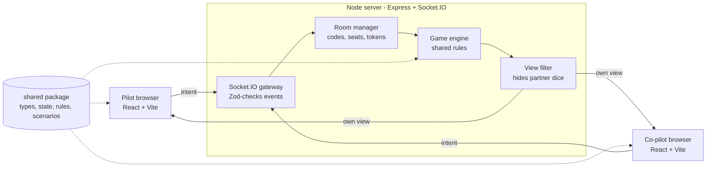

# Sky Team Online — Build Plan

Sep 28, 2026 · exported from the Claude doc (the live version may be newer)

## Overview

Build an online, 2-player version of Sky Team where the Node server is the referee: it holds the real game state, validates every move, and sends each player only what they may see.

**Scope for v1:** room codes, pilot/co-pilot seats, the base airport scenario, dice placement on all cockpit systems, coffee tokens, win/crash detection, reconnection, a responsive UI for phones, tablets and desktop, and a public deploy. Extra airports and modules come after v1.

**Key principle:** never trust the client. The browser only sends intents ("place die 2 on the axis slot"); the server checks the rules and broadcasts the result.

| Layer | Choice | Why |
| --- | --- | --- |
| Language | TypeScript (strict) everywhere | Shared types catch rule and protocol bugs |
| Monorepo | pnpm workspaces | One repo, `shared` imported by both sides |
| Server | Node 20+, Express, Socket.IO | Rooms, acks and reconnection built in |
| Client | React + Vite | Fast dev server, simple static build; Tailwind CSS v4 for styling |
| UI components | shadcn/ui (lobby, dialogs, drawer, toasts only) | Accessible pieces copied into the repo; the board stays custom |
| Client state | Zustand (or React context) | Holds the latest server view, nothing else |
| Validation | Zod | Checks every incoming socket payload |
| Unit/integration tests | Vitest | Same runner for shared, server and client |
| Component tests | React Testing Library | Board and dice tray behaviour |
| E2E tests | Playwright | Two browser contexts = two real players |
| Hosting | Render, Railway or Fly.io | Long-running Node process with WebSockets |

This is a personal/learning project: if it is ever published, use an original name and artwork rather than the publisher's.

## Architecture

One Node process serves the built React app and runs Socket.IO; both sides import the same `shared` package so rules are written once.



Each move flows through the server, then each player receives their own filtered view.

```
sky-team/
├── package.json            # pnpm workspaces root
├── pnpm-workspace.yaml
├── tsconfig.base.json
├── packages/
│   ├── shared/
│   │   └── src/
│   │       ├── types.ts        # GameState, Seat, Slot, events
│   │       ├── state.ts        # createGame()
│   │       ├── rules.ts        # canPlaceDie, placeDie, endRound, checkLanding
│   │       ├── views.ts        # viewFor(state, seat)
│   │       ├── scenarios.ts    # airport configs as data
│   │       └── rng.ts          # seedable dice roller
│   ├── server/
│   │   └── src/
│   │       ├── index.ts        # Express + Socket.IO bootstrap
│   │       ├── rooms.ts        # create/join/leave, cleanup
│   │       ├── handlers.ts     # socket event handlers
│   │       └── schemas.ts      # Zod payload schemas
│   └── client/
│       └── src/
│           ├── main.tsx
│           ├── socket.ts       # typed socket instance
│           ├── store.ts        # Zustand store for the view
│           ├── screens/        # Lobby, Game, GameOver
│           └── components/     # Board, DiceTray, Slot, Tracks (+ components/ui from shadcn)
├── e2e/                        # Playwright tests
└── .github/workflows/ci.yml
```

## Game state and rules

The whole game is one serialisable `GameState` object plus pure functions that return a new state; no rule lives in React or in socket handlers.

```ts
// packages/shared/src/types.ts
export type Seat = 'pilot' | 'copilot';
export type Phase = 'lobby' | 'strategy' | 'placing' | 'resolving' | 'won' | 'crashed';

export type SlotId =
  | 'axisPilot' | 'axisCopilot'
  | 'enginePilot' | 'engineCopilot'
  | 'radioPilot' | 'radioCopilot1' | 'radioCopilot2'
  | 'gear1' | 'gear2' | 'gear3'            // pilot
  | 'brakes1' | 'brakes2' | 'brakes3'      // pilot, in order
  | 'flaps1' | 'flaps2' | 'flaps3' | 'flaps4' // copilot, in order
  | `concentration${1 | 2 | 3}`;           // either player

export interface Die { id: string; value: 1 | 2 | 3 | 4 | 5 | 6; }

export interface GameState {
  roomCode: string;
  scenarioId: string;
  phase: Phase;
  round: number;
  altitude: number;                 // e.g. 6000 -> 0
  currentSeat: Seat;
  firstSeat: Seat;                  // alternates per scenario rules
  dice: Record<Seat, Die[]>;        // unplaced dice (secret)
  placed: Partial<Record<SlotId, { seat: Seat; value: number }>>;
  axis: number;                     // crash when |axis| > 2
  approachIndex: number;            // position on approach track
  approachPlanes: number[];         // plane count per space
  aeroBlue: number;                 // raised by landing gear
  aeroOrange: number;               // raised by flaps
  gear: [boolean, boolean, boolean];
  flaps: [boolean, boolean, boolean, boolean];
  brakes: number;
  coffee: number;                   // 0..3
  rngSeed: number;
  log: GameEvent[];                 // for replay and debugging
  endReason?: string;
}
```

Rule functions in `rules.ts`, each pure and unit-tested:

1. `createGame(scenario, seed)` builds the start state.
2. `rollDice(state)` rolls 4 dice per seat with the seeded RNG and moves to `placing`.
3. `canPlaceDie(state, seat, dieId, slot, coffeeDelta)` returns `{ ok: true }` or `{ ok: false, reason }`.
4. `placeDie(state, seat, dieId, slot, coffeeDelta)` applies the slot effect and passes the turn.
5. `resolveRound(state)` applies axis, engine speed, approach movement and altitude, then checks for crashes.
6. `checkLanding(state)` on the final round: approach clear, axis level, all gear and flaps down, brakes above speed.

Use a **seedable RNG** (e.g. mulberry32) so any bug can be replayed from `rngSeed` + `log`. Check exact slot values and thresholds against the rulebook while writing tests; the numbers above are a starting model.

## Socket.IO protocol

All events are typed once in `shared` and used by both `Server<...>` and `Socket<...>`, so a renamed event breaks the build instead of the game.

| Direction | Event | Payload | Server response |
| --- | --- | --- | --- |
| Client → Server | `room:create` | `{ name }` | ack `{ code, seat, token }` |
| Client → Server | `room:join` | `{ code, name }` | ack `{ seat, token }` or error |
| Client → Server | `room:rejoin` | `{ code, token }` | ack + fresh `game:view` |
| Client → Server | `game:ready` | `{}` | rolls dice when both ready |
| Client → Server | `game:place` | `{ dieId, slot, coffeeDelta }` | ack `{ ok }` or `{ ok:false, reason }` |
| Client → Server | `chat:send` | `{ text }` | rejected during `placing` |
| Client → Server | `game:rematch` | `{}` | new game, same room |
| Server → Client | `game:view` | `PlayerView` | after every change |
| Server → Client | `room:presence` | `{ pilot, copilot }` online flags | on join/leave |
| Server → Client | `chat:message` | `{ seat, text, at }` | strategy phase only |

```ts
// packages/shared/src/events.ts
export interface ClientToServer {
  'room:create': (p: { name: string }, ack: (r: JoinResult) => void) => void;
  'room:join':   (p: { code: string; name: string }, ack: (r: JoinResult) => void) => void;
  'game:place':  (p: PlaceIntent, ack: (r: MoveResult) => void) => void;
  // ...
}
export interface ServerToClient {
  'game:view': (v: PlayerView) => void;
  // ...
}
```

**Hidden information.** `viewFor(state, seat)` is the only way state leaves the server:

- Your own unplaced dice: full values.
- Partner's unplaced dice: a count only (`partnerDiceLeft: 3`).
- Placed dice, tracks, coffee, altitude: public.
- `rngSeed` and the log's future rolls: never sent.

**No-talking rule in code.** Chat is open in the `strategy` phase between rounds and locked from the moment dice are rolled, mirroring the table rule.

**Server handler pattern:** parse payload with Zod → check seat and turn → `canPlaceDie` → `placeDie` → maybe `resolveRound` → emit `viewFor` to each seat. Any failure returns `{ ok:false, reason }` and changes nothing.

## Responsive UI (mobile web)

Design mobile-first: a phone in portrait (360–430 px wide) is the hardest screen, so build it first and let larger screens spread the same components out.

```
Phone portrait (< 600 px)        Desktop (>= 1024 px)
+----------------------+         +------------------------------------------+
| Status bar           |         | Status bar                               |
+----------------------+         +--------+----------------------+----------+
| Tracks strip         |         | Tracks | Cockpit board        | Chat +   |
+----------------------+         |        | (all slots visible)  | log      |
| Cockpit panel        |         |        |                      |          |
| (scrolls; your slots |         |        +----------------------+          |
|  first; chat = sheet)|         |        | Dice tray            |          |
+----------------------+         +--------+----------------------+----------+
| Dice tray (fixed)    |
+----------------------+
```

The same React components rearrange through CSS Grid areas; only the layout changes, never the game logic. Set the widths below as custom Tailwind breakpoints in `@theme` (tablet at 600px, desktop at 1024px) and write mobile-first classes, e.g. `grid-cols-1 tablet:grid-cols-2 desktop:grid-cols-3`.

| Screen | Width | Layout |
| --- | --- | --- |
| Phone portrait | under 600 px | Stacked: status bar, tracks strip, scrolling cockpit, dice tray fixed at bottom; chat in a bottom sheet |
| Phone landscape / tablet | 600–1023 px | Two columns: tracks + cockpit left, dice tray + chat right |
| Desktop | 1024 px and up | Three columns: tracks, cockpit board, chat + log; dice tray under the board |

**Layout and styling**

- Tailwind CSS v4, with design tokens (colors, spacing, fonts) defined once in `@theme`, so they work as utility classes and as CSS variables for the SVG board. Keep long class lists readable by extracting small components (Slot, Die, Panel) rather than using `@apply` everywhere.
- shadcn/ui for the lobby (Button, Input, Card), Dialog, Drawer (phone bottom sheet), toasts, Tooltip/Popover, Select/Tabs. Build the cockpit, dice, tracks and alarm board yourself.
- CSS Grid with named `grid-template-areas` per breakpoint; container queries for the cockpit so it adapts to its column, not the window.
- Fluid sizes with `clamp()`; draw the board and tracks as SVG with a `viewBox` so they scale without blurring.
- Use `100dvh` (not `100vh`) and `env(safe-area-inset-*)` so the dice tray clears the iPhone home bar and notches.

**Touch interaction**

- Tap a die, then tap a slot. No drag-and-drop required; add drag on desktop later as an extra.
- Touch targets at least 44 × 44 px; dice and slots never smaller.
- Coffee ± appears as large buttons next to the selected die.
- `touch-action: manipulation` to stop double-tap zoom; inputs at 16 px or more so iOS does not zoom on focus.
- No hover-only information: anything shown on hover also shows on tap.
- Clear turn feedback: a banner plus optional `navigator.vibrate` on Android when it becomes your turn.

**Mobile browser behaviour**

- Phones pause sockets when the tab is in the background: on `visibilitychange` back to visible, reconnect and send `room:rejoin` with the saved token.
- Optional Screen Wake Lock during a game so the phone does not sleep mid-round.
- Share the room link with the Web Share API (`navigator.share`), falling back to copy-to-clipboard.
- Optional PWA manifest and icon so players can add the game to their home screen.
- Keep the bundle small (code-split the lobby and game screens) for slow mobile networks.

## Build phases

Eleven phases, each ending in something you can run; do not start networking until Phase 1's tests pass.

### Phase 0: Project setup

- [x] Create the pnpm workspace with `shared`, `server`, `client` packages
- [x] `tsconfig.base.json` with `strict: true`, path aliases for `@sky/shared`
- [x] Tailwind CSS v4 in the client via the `@tailwindcss/vite` plugin; ESLint + Prettier (with the Tailwind class-sorting plugin), Vitest at the root
- [x] shadcn/ui init in `packages/client` (`@/` alias), add components only as needed
- [x] Scripts: `dev` (server + Vite together via `concurrently`), `build`, `test`, `e2e`
- [x] Add a CI workflow (`.github/workflows/ci.yml`: typecheck, lint, format check, test, build)
- [ ] Push to GitHub (local repo initialised on `main`; no remote yet)

**Done when:** `pnpm dev` starts both apps and `pnpm test` runs an empty suite. ✅ Verified Sep 28, 2026.

Setup notes: pnpm 12 via corepack (esbuild approved in `allowBuilds`); TypeScript pinned to 6.0 because typescript-eslint does not support TS 7 yet; shadcn uses the Radix base with the Nova preset (`cn` package in place of clsx + tailwind-merge); Vite proxies `/health` and `/socket.io` to the server on port 3000.

### Phase 1: Core rules in `shared`

- [ ] Types for state, slots, dice, events
- [ ] Seedable RNG and `createGame`
- [ ] `canPlaceDie` / `placeDie` for every slot type
- [ ] Coffee: earn on concentration, spend for ±1
- [ ] `resolveRound`: axis, speed from engines vs aero markers, approach movement, altitude
- [ ] Crash checks: axis out of range, moving into planes, overshooting
- [ ] `checkLanding` win conditions
- [ ] Script that plays random legal moves to the end, 1,000 times

**Done when:** unit tests cover every rule and the random-play script never throws.

### Phase 2: Server and rooms

- [ ] Express serves `/health`; Socket.IO attached to the same HTTP server
- [ ] Room manager: 4-letter codes, seat assignment, reconnect tokens
- [ ] Handlers for `room:create`, `room:join`, `game:ready`
- [ ] Zod schemas for every incoming payload

**Done when:** two socket clients in an integration test can join the same room and both receive a `game:view`.

### Phase 3: Gameplay over the wire

- [ ] `game:place` handler using the shared rules
- [ ] `viewFor` filtering, emitted to each seat after every change
- [ ] Chat locked during `placing`
- [ ] Round resolution and game over broadcast

**Done when:** a scripted two-client test plays a full game over sockets and no payload ever contains the partner's dice values.

### Phase 4: React client

- [ ] Typed socket singleton + Zustand store holding the latest `PlayerView`
- [ ] Mobile-first layout shell: CSS Grid areas for phone, tablet and desktop (see Responsive UI)
- [ ] Lobby screen: create game, join by code, copy invite link (`/r/ABCD`), Web Share on phones
- [ ] Board: axis, engines, radio, gear, flaps, brakes, concentration, altitude and approach tracks, drawn as scalable SVG
- [ ] Dice tray: tap a die, then tap a slot; valid slots highlighted via shared `canPlaceDie`
- [ ] Coffee ± control, turn indicator, round and altitude display, all with 44 px touch targets
- [ ] Strategy-phase chat panel (bottom sheet on phones), locked state while placing
- [ ] Reconnect on `visibilitychange` when a phone brings the tab back
- [ ] Game over screen with reason and rematch

**Done when:** two people on your LAN, one on a desktop and one on a phone in portrait, can finish the base scenario.

### Phase 5: Robustness

- [ ] Reconnect: token in `localStorage`, `room:rejoin` restores the seat
- [ ] Presence indicator when the partner drops
- [ ] Idempotent moves (ignore duplicate `game:place` from double clicks)
- [ ] Room cleanup after 30 minutes idle; limit rooms per IP
- [ ] Handle one or both players leaving mid-game

**Done when:** refreshing either tab mid-round resumes the game exactly.

### Phase 6: Tests and CI

- [ ] Unit, integration and Playwright suites green in GitHub Actions (see Testing)

### Phase 7: Deploy

- [ ] Production build and hosting (see Deployment)

**Done when:** a friend in another city plays a full game on the public URL.

### Phase 8: Base game airports and modules

v1 ships one airport; this phase fills in the rest of the base box and builds the module system the expansion needs.

- [ ] Module hook system: a scenario lists its active modules; each module adds its own state and hooks into rolling, `canPlaceDie`, `placeDie` and `resolveRound`
- [ ] Remaining base-box airports and scenarios as scenario data (11 airports, 21 scenarios)
- [ ] Base modules (wind, kerosene, traffic, ice, intern and the rest) as rule hooks, one at a time, each with tests
- [ ] Scenario picker in the lobby, with difficulty shown
- [ ] UI slots and tracks for each module, placed for phone and desktop layouts

**Done when:** every base scenario plays end to end and random-play fuzzing passes on all of them.

### Phase 9: Turbulence expansion

The Turbulence expansion ([publisher page](https://www.scorpionmasque.com/en/sky-team-turbulence)) adds 10 destinations, 20 harder scenarios and new modules including Turbulence, Low Visibility and Alarms; it needs Phase 8's module system.

- [ ] Read the expansion rulebook and list every new rule as a test case before coding
- [ ] Add the new approach and altitude tracks and the 20 scenarios as scenario data, tagged `expansion: 'turbulence'`
- [ ] Turbulence module as a rule hook
- [ ] Low Visibility module; if it hides information from players, extend `viewFor` so hidden values never leave the server
- [ ] Alarms module: alarm board state, alarm tokens, and blocked actions checked in `canPlaceDie`
- [ ] Scenario-specific extras (e.g. the Antarctica penguin tokens)
- [ ] UI: alarm board panel and new track art, fitting the phone bottom-sheet and desktop column layouts
- [ ] Lobby: "Turbulence" filter in the scenario picker; allow mixing expansion modules into base scenarios if the rulebook permits
- [ ] Tests: unit tests per module, one Playwright game per new module, fuzzing across all 41 scenarios

**Done when:** all 20 expansion scenarios play end to end on phone and desktop with tests green.

### Phase 10: Extras

- [ ] Redis or SQLite persistence so games survive restarts
- [ ] Animations, sound, drag-and-drop on desktop
- [ ] Accounts and game history

## Testing

Most bugs in a board game are rule bugs, so the bulk of tests sit on the pure `shared` functions, with fewer, slower tests further out.

| Layer | Tool | What it covers | Runs |
| --- | --- | --- | --- |
| Unit | Vitest | Every rule in `rules.ts`, `viewFor`, scenarios | Every save, every push |
| Property / fuzz | Vitest + fast-check | Random legal games never throw; axis and coffee stay in range; dice never leak | Every push |
| Integration | Vitest + `socket.io-client` | Real server on a random port, two clients: join, play, reconnect, illegal moves rejected | Every push |
| Component | React Testing Library | Dice tray selection, valid-slot highlighting, locked chat | Every push |
| End-to-end | Playwright | Two browser contexts play the base scenario to a win and to a crash | Every push to `main`, before deploy |
| Manual | Two machines | Latency, reconnects on mobile data, UX feel | Before each release |

**Rule tests to write first:**

- Axis: difference between pilot and co-pilot dice moves it the right way; beyond the limit crashes.
- Engines: speed below, between and above the aero markers advances 0, 1 or 2.
- Radio removes a plane at the right distance; moving into a space with planes crashes.
- Gear and flaps raise the right aero marker; flaps must go in order.
- Brakes must go in order and exceed final speed.
- Coffee: capped at 3, each token shifts ±1, never below 1 or above 6.
- Landing: each failed condition produces a crash with a clear `endReason`.

**Security tests:** send a move out of turn, for the wrong seat, with a die you don't own, with a malformed payload, and assert state is unchanged. Snapshot every `game:view` in the integration suite and assert the partner's die values never appear.

**Determinism:** tests pass a fixed seed to `createGame`, so dice rolls are known and failures reproduce.

**Local multiplayer check:** one normal window and one incognito window, or Playwright's `browser.newContext()` twice.

**Mobile checks:**

- Playwright projects for `Desktop Chrome`, `iPhone 13` (WebKit) and `Pixel 7`, so E2E also runs at phone sizes.
- One E2E game with a desktop player and a phone player.
- Real devices on your LAN: `vite --host`, open your computer's IP on the phone; debug iOS with Safari Web Inspector and Android with `chrome://inspect`.
- Test backgrounding: switch apps mid-round on a phone and confirm the game resumes.
- Lighthouse mobile audit in CI for performance and tap-target size.

## Deployment

Ship one Docker image running one Node process that serves the built React files and Socket.IO on the same port; run a single instance while game state lives in memory.

**Build**

1. `pnpm -r build`: Vite outputs `client/dist`, `tsc` (or tsup) outputs `server/dist`.
2. Express serves `client/dist` as static files with a fallback to `index.html` for `/r/:code` links.
3. Same origin for page and socket, so no CORS setup is needed in production.

```dockerfile
FROM node:20-alpine AS build
WORKDIR /app
RUN corepack enable
COPY . .
RUN pnpm install --frozen-lockfile && pnpm -r build

FROM node:20-alpine
WORKDIR /app
ENV NODE_ENV=production
COPY --from=build /app .
EXPOSE 3000
CMD ["node", "packages/server/dist/index.js"]
```

**Hosting options** (all run a long-lived Node process with WebSockets):

| Host | Deploy from | Notes (checked Sep 2026) |
| --- | --- | --- |
| Render | GitHub repo or Dockerfile | Free tier: sleeps after 15 min with no HTTP or WebSocket traffic, ~1 min to wake, may restart anytime. Best for testing. |
| Railway | GitHub repo or Dockerfile | $5 one-time trial, then Free plan with $1/month credit (0.5 GB RAM); Hobby $5/month |
| Fly.io | `fly deploy` with Dockerfile | No free tier for new accounts; ~$2/month for the smallest always-on machine. Singapore region is close to Vietnam. |

Check each host's current pricing and sleep rules before choosing; a sleeping or restarting free instance drops live games.

**Environment variables:** `PORT` (from host), `NODE_ENV=production`, `ROOM_TTL_MINUTES=30`, `LOG_LEVEL=info`, optional `SENTRY_DSN`.

**CI/CD with GitHub Actions**

1. On every push and PR: install, typecheck, lint, unit + integration tests.
2. On push to `main`: build, run Playwright against the built server, then trigger the host's deploy (deploy hook or `fly deploy`).
3. Block deploy if any step fails.

**After deploy**

- [ ] `/health` returns 200 and the host's health check uses it
- [ ] WebSocket transport actually used (check the browser's Network tab, not long-polling only)
- [ ] Structured logs (pino) for room created/joined/ended and rejected moves
- [ ] Error tracking (Sentry) on client and server
- [ ] Custom domain + HTTPS (provided by all three hosts)

**Scaling later:** more than one instance needs a shared store (Redis) for game state, the Socket.IO Redis adapter, and sticky sessions. Not needed for v1.

## Risks and tips

The biggest risk is getting rules subtly wrong, so treat the rulebook as the spec and encode each rule as a test before the UI exists.

| Risk | Mitigation |
| --- | --- |
| Rule misread or edge case missed | One test per rule sentence; random-play fuzzing |
| Partner's dice leak to the client | `viewFor` is the only exit; snapshot tests on every view |
| Player refreshes or loses connection | Reconnect tokens + full view on rejoin |
| Server restart ends live games | Accept for v1; add Redis persistence later |
| Free host sleeps mid-game | Use a plan that stays awake, or a keep-alive only while rooms exist |
| Client and server drift apart | Shared types and rules in one package, one repo |
| Publishing someone else's IP | Original name and art if it goes public |

**Tips**

- Keep React "dumb": it renders `PlayerView` and sends intents, nothing more.
- Add a debug panel in development that shows the full server state and lets you set the seed.
- Log every accepted move with the seed; a bug report then becomes a replayable test.
- Build the base airport end to end before adding any module.
