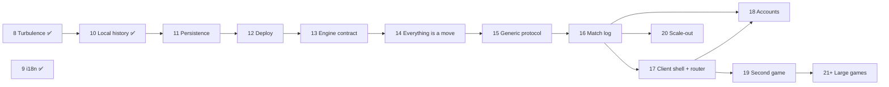

# Sky Team Online — Master Plan

Last restructured Oct 4, 2026: phases renumbered in execution order (old 10 i18n → 9, old 11 stage A history → 10, old 9 persistence → 11, old 11 stage B accounts → 18) and the multi-game platform added as phases 13–21 ([proposal](proposals/multi-game-platform.md)). This file is the big picture only; each phase has its own file in [`phases/`](phases/) with goals, scope, tasks and a checklist, and the long-lived technical references live in [`reference/`](reference/).

## Vision

An online, cooperative, 2-player version of the board game Sky Team: a pilot and a co-pilot land a plane by placing dice in silence, each on their own device (phone, tablet or desktop). The Node server is the referee: it holds the real game state, validates every move and sends each player only what they may see.

**Principles**

- **Never trust the client.** Browsers send intents; the server checks them with the shared rules and broadcasts each player's own view (`viewFor` is the only exit).
- **Rules are pure, tested functions** in `packages/shared`, written once and used by both server and client.
- **Mobile first.** A phone in portrait is the primary screen.
- **The rulebook is the spec.** Unclear rules are asked, not guessed; numbers not printed in the booklets are marked as placeholders until verified.
- **Always shippable.** Every phase ends green: typecheck, lint, format, tests, build.

This is a personal/learning project: if it is ever published, use an original name and artwork rather than the publisher's.

**Later: a multi-game platform.** Once Sky Team is complete and deployed (M4–M5), the app grows into a platform where players pick a game (Pandemic, Isle of Skye, Twilight Struggle…) in the lobby. The design is in the [multi-game proposal](proposals/multi-game-platform.md): a game-agnostic engine contract, everything as moves, one protocol, a move log for persistence, and a client shell that lazy-loads each game's UI.

## Milestones

| Milestone | Outcome | Phases | Status |
| --- | --- | --- | --- |
| **M1 — Playable online base game** | Two people finish the YUL scenario online, on phone and desktop, with reconnection and CI | 0–6 | ✅ Done (Sep 29, 2026) |
| **M2 — Complete base box** | All Flight Log scenarios, modules and Special Abilities | 7 | ✅ Done (Oct 2, 2026) |
| **M3 — Turbulence expansion** | The 20 expansion scenarios and their modules | 8 | ✅ Done (Oct 4, 2026) |
| **M4 — Sky Team complete** | Vietnamese and French languages, local game history (Flight Log), games survive restarts | 9–11 | 🚧 In progress (9, 10 done) |
| **M5 — Launch** | The game on a private URL friends can open (Fly.io + SQLite, Cloudflare Access), monitored | 12 | ⏳ Not started |
| **M6 — Multi-game platform** | Sky Team runs on a game-agnostic engine, protocol, match log and client shell; accounts; a second game proves it | 13–19 | ⏳ Not started |
| **M7 — Scale and large games** | Several server instances when needed; large games one by one | 20–21+ | ⏳ Not started |

## Phases

| # | Phase | Milestone | Status | Effort |
| --- | --- | --- | --- | --- |
| 0 | [Project setup](phases/phase-00-setup.md) | M1 | ✅ Done | — |
| 1 | [Core rules in `shared`](phases/phase-01-core-rules.md) | M1 | ✅ Done | — |
| 2 | [Server and rooms](phases/phase-02-server-rooms.md) | M1 | ✅ Done | — |
| 3 | [Gameplay over the wire](phases/phase-03-gameplay-over-the-wire.md) | M1 | ✅ Done | — |
| 4 | [React client](phases/phase-04-react-client.md) | M1 | ✅ Done | — |
| 5 | [Robustness](phases/phase-05-robustness.md) | M1 | ✅ Done | — |
| 6 | [Tests and CI](phases/phase-06-tests-ci.md) | M1 | ✅ Done | — |
| 7 | [Base game airports and modules](phases/phase-07-base-airports-modules.md) | M2 | ✅ Done | — |
| 8 | [Turbulence expansion](phases/phase-08-turbulence.md) | M3 | ✅ Done | High |
| 9 | [I18n (EN + VI + FR)](phases/phase-09-i18n.md) | M4 | ✅ Done (French Oct 5, 2026) | Medium (FR: low-medium) |
| 10 | [Game history (local)](phases/phase-10-history.md) | M4 | ✅ Done | Low |
| 11 | [Persistence](phases/phase-11-persistence.md) | M4 | ⏳ Not started | Medium-low |
| 12 | [Deploy](phases/phase-12-deploy.md) | M5 | ⏳ Not started | Medium |
| 13 | [Engine contract](phases/phase-13-engine-contract.md) | M6 | ⏳ Not started | Low-medium |
| 14 | [Everything is a move](phases/phase-14-everything-is-a-move.md) | M6 | ⏳ Not started | Medium |
| 15 | [Generic protocol](phases/phase-15-generic-protocol.md) | M6 | ⏳ Not started | Medium |
| 16 | [Match log (persistence for every game)](phases/phase-16-match-log.md) | M6 | ⏳ Not started | Medium |
| 17 | [Client shell and router](phases/phase-17-client-shell.md) | M6 | ⏳ Not started | Medium-high |
| 18 | [Accounts and match history](phases/phase-18-accounts.md) | M6 | ⏳ Not started | High |
| 19 | [A second, small game](phases/phase-19-second-game.md) | M6 | ⏳ Not started | Medium |
| 20 | [Scale-out](phases/phase-20-scale-out.md) | M7 | ⏳ Only when metrics ask | Medium |
| 21+ | [Large games](phases/phase-21-big-games.md) | M7 | ⏳ Not started | High per game |

Status legend: ✅ done · 🚧 in progress · ⏳ not started.

## Dependencies and suggested order

- **Sky Team first** (decided Oct 4, 2026): Phases 10–12 finish and ship Sky Team before the platform work starts.
- **Hosting and storage decided (Oct 4, 2026):** a private site on one Fly.io machine with auto stop/start, SQLite on a Fly volume (Drizzle, Litestream backups), Cloudflare Access in front; about $1.50–2.50/month plus the domain. This holds for the multi-game platform too; Postgres only if Phase 20 happens. Keep Phase 11's store behind an interface, since **Phase 16** turns it into the platform's move log.
- **Phases 13–15** are a refactor: Sky Team must play exactly as before at the end of each.
- **Phase 18** (accounts) needs the match store (16), the router pages (17) and the production domain (12).
- **Phase 20** starts only when metrics show one server is not enough.

Suggested next steps: Phase 11 + 12 together → Phases 13–19 in order.

## Open items carried from finished phases

None

## How to work with this plan

1. Pick the next phase from the table; read its file; build it task by task.
2. Tick checklist items in the **phase file** as they are completed. Leave unfinished items unticked with a reason.
3. When a phase's "Done when" check passes (plus `pnpm test`, `pnpm typecheck`, `pnpm lint`, `pnpm format:check`, `pnpm build`), add "✅ Verified <date>" to its "Done when" line and update its status here.
4. Keep the [reference docs](#reference) and `CLAUDE.md` in sync with the code.
5. New ideas go into the matching phase file, or a new phase file linked from the table above.

## Reference

- [Architecture](reference/architecture.md): stack, data flow, repository layout, handler pattern.
- [Game state and rules](reference/game-rules.md): files, base-game numbers, modules, abilities, placeholders, assumptions.
- [Socket.IO protocol](reference/protocol.md): events, acks, hidden information, idempotency.
- [Responsive UI](reference/ui.md): layouts per screen size, touch and mobile behaviour.
- [Testing strategy](reference/testing.md): test layers, rules for tests, device checks.
- [Sharing and deployment](reference/sharing-and-deployment.md): Cloudflare tunnel, Docker, hosts, environment variables.
- [Multi-game platform proposal](proposals/multi-game-platform.md): target architecture for Phases 13–21.

## Risks

| Risk | Mitigation |
| --- | --- |
| Rule misread or edge case missed | Rulebook as the spec; one test per rule; random-play fuzzing on every scenario |
| Board data not in any booklet | Mark placeholders; read values off the physical tiles; tests independent of the data |
| Partner's dice leak to the client | `viewFor` is the only exit; leak checks on every view in integration tests |
| Player refreshes or loses connection | Reconnect tokens + full view on rejoin |
| Server restart ends live games | Phase 11 persistence |
| Free host sleeps or restarts mid-game | Pick a host that stays awake (Phase 12) |
| Scope creep as the project grows | One file per phase, explicit "In/Out" scope, milestones |
| Publishing someone else's IP | Original name and art if it goes public |
