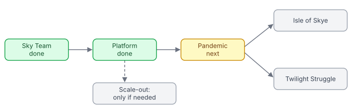
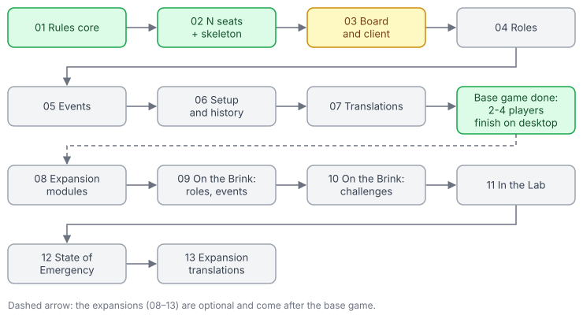

# Board Game Platform — Master Plan

Restructured into **epics**: one per game, plus one for the shared platform. Each epic has its own folder in [`epics/`](epics/) with an `EPIC.md` (goal, phase table, dependencies, "Epic done when") and one file per phase (goals, scope, tasks, checklist, "Done when"). Phases are numbered from 01 inside each epic and named after it: "Sky Team 12", "Platform 04". Long-lived technical references live in [`reference/`](reference/); the platform design is in [`proposals/`](proposals/).

## Vision

A private web platform, like Board Game Arena, where friends play board games together, each on their own device (phone, tablet or desktop). It starts with **Sky Team** (a cooperative 2-player game: a pilot and a co-pilot land a plane by placing dice in silence) and grows to more games: Pandemic first, then Isle of Skye and Twilight Struggle. The Node server is the referee: it holds the real game state, validates every move and sends each player only what they may see.

**Principles**

- **Never trust the client.** Browsers send intents; the server checks them with the game's rules and sends each player their own view (`viewFor`, later `definition.view`, is the only exit).
- **Rules are pure, tested functions**, written once and used by both server and client.
- **Mobile first.** A phone in portrait is the primary screen.
- **The rulebook is the spec.** Unclear rules are asked, not guessed; numbers not printed in the booklets are marked as placeholders until verified.
- **Always shippable.** Every phase ends green: typecheck, lint, format, tests, build.

This is a personal/learning project on a private, invite-only site: if it is ever published, use original names and artwork, or the publishers' permission.

## Epics

| Epic | Goal | Phases | Status | Needs |
| --- | --- | --- | --- | --- |
| [Sky Team](epics/sky-team/EPIC.md) | Sky Team complete (base box, Turbulence, 3 languages, history, saved games) and deployed privately | 01–13 | ✅ Done; live at `boardgames-dom-mam.fly.dev` | — |
| [Platform](epics/platform/EPIC.md) | A game-agnostic core: engine contract, moves, protocol, match log, client shell, accounts | 01–06 | ✅ Done | Sky Team |
| [Scale-out](epics/scale-out/EPIC.md) | Several server instances, only when metrics or a public site ask for it | 01 | ⏳ Only when needed | Platform 01–06 |
| [Pandemic](epics/pandemic/EPIC.md) | Pandemic, 2–4 players co-op; the second game, proving the platform | 01–07 base game, 08–13 expansions | 🚧 In progress | Platform |
| [Isle of Skye](epics/isle-of-skye/EPIC.md) | Isle of Skye, 2–5 players | planned | ⏳ Not started | Platform, Pandemic |
| [Twilight Struggle](epics/twilight-struggle/EPIC.md) | Twilight Struggle, 2 players, long games | planned | ⏳ Not started | Platform, Pandemic |

Status legend: ✅ done · 🚧 in progress · ⏳ not started.

## Order

**Epics:**

The large games's order is open; each comes after Pandemic, which proves the platform.

**Current epic: [Pandemic](epics/pandemic/EPIC.md):**

The diagrams are SVG pictures in `docs/diagrams/`. Update `pandemic-phases.svg` when a phase changes status (change the box's fill, stroke and text colors to the `done`, `next` or `todo` set used by the other boxes), and replace it with the next epic's phases when the current one is done. Update `epics.svg` the same way when an epic changes status.

- **Sky Team first**: Sky Team 12–13 finish and ship Sky Team before the platform work starts.
- **Hosting and storage decided:** a private site on one Fly.io machine with auto stop/start, SQLite on a Fly volume (Drizzle, Litestream backups), Cloudflare Access in front; about $1.50–2.50/month plus the domain. This holds for the whole platform; Postgres only if the Scale-out epic happens.
- **Platform 01–03 are a refactor:** Sky Team must play exactly as before at the end of each.
- **Large games** come one epic at a time, after Pandemic has proved the platform; their order is open.

Suggested next steps: Pandemic → the large games (Scale-out only if metrics ask). (Sky Team is done and live; follow-up: check the first month's Fly bill.)

## Game epic template

Every new game epic follows the same shape; online play, saving and accounts come from the Platform epic, so a game's "backend" is its rules package and its engine adapter. **Rules core first, then a walking skeleton** (the platform changes the game needs plus a plain client, so players finish a basic game early and platform gaps show up in phase 02), **then features as slices with their rules and UI together** (not all rules, then all UI, as Sky Team 01–07 did before the platform existed):

| # | Phase | Content |
| --- | --- | --- |
| 01 | Rules core | the base game without its optional parts: pure rules, `GameDefinition`, views, tests, random play through the engine test kit; no UI |
| 02 | Platform changes and walking skeleton | whatever the platform lacks for this game (seats, move kinds, timers…), kept game-agnostic and recorded in the proposal; registry entries; a plain client; players finish a basic game in Playwright |
| 03 | Board and client | the real `Board` (a desktop-only game such as Pandemic skips phone and tablet layouts); acting from the board, prompts, game over |
| 04+ | Feature slices | one phase per feature (roles, events, card sets…), its rules and UI together |
| next | Setup, variants and history | lobby options, preflight choices, the Flight Log; the epic's "done when" check |
| next | Translations | EN, VI, FR |
| last | Expansions | only if wanted; one phase each |

**Phase files:** a phase may be large (medium-high, high, extra high); its work is broken into tasks of **low or medium** effort (about one sitting each, ending with typecheck, lint and format passing; tests come at the end of the phase, after your review), written as a checklist under "Tasks": `- [ ] 1. **L** …` / `- [ ] 2. **M** …`, grouped by area (rules, client, checks). The phase file also keeps its own short "Checklist" of phase-level checks, its Open questions and its "Done when" line. The `EPIC.md` phase table shows each phase's effort and number of tasks.

A new epic gets a folder `epics/<game>/` with an `EPIC.md` and a row in the table above; its phase files are written when the epic starts (or each one when it starts, for an epic far ahead).

## How to work with this plan

1. Pick the next phase from the suggested order; read its epic's `EPIC.md` and the phase file; build it task by task.
2. Tick task and checklist items in the **phase file** as they are completed. Leave unfinished items unticked with a reason.
3. When a phase's "Done when" check passes (plus `pnpm test`, `pnpm typecheck`, `pnpm lint`, `pnpm format:check`, `pnpm build`), add "✅ Verified" to its "Done when" line and update its status in the epic's `EPIC.md` (and the epic's status here when it changes).
4. Keep the [reference docs](#reference) and `CLAUDE.md` in sync with the code.
5. New ideas go into the matching phase file, a new phase in the right epic, or a new epic.

## Reference

- [Architecture](reference/architecture.md): stack, data flow, repository layout, handler pattern.
- [Game state and rules](reference/game-rules.md): Sky Team's files, numbers, modules, abilities, placeholders, assumptions.
- [Socket.IO protocol](reference/protocol.md): events, acks, hidden information, idempotency.
- [Responsive UI](reference/ui.md): layouts per screen size, touch and mobile behavior.
- [Testing strategy](reference/testing.md): test layers, rules for tests, device checks.
- [Sharing and deployment](reference/sharing-and-deployment.md): Cloudflare tunnel, chosen hosting, Docker, environment variables.
- [Multi-game platform proposal](proposals/multi-game-platform.md): target architecture for the Platform epic.

## Risks

| Risk | Mitigation |
| --- | --- |
| Rule misread or edge case missed | Rulebook as the spec; one test per rule; random-play fuzzing on every scenario |
| Board data not in any booklet | Mark placeholders; read values off the physical pieces; tests independent of the data |
| Hidden information leaks to a client | One view function per game is the only exit; leak checks on every view (engine test kit) |
| Player refreshes or loses connection | Reconnect tokens + full view on rejoin |
| Server restart ends live games | Sky Team 12 persistence, then the match log (Platform 04) |
| Fly machine stopped when a timer is due | Deadlines stored in the game and checked on load; notifications from an outside cron |
| Platform shaped by one game | The contract is designed against all target games; Pandemic proves it before the other large games |
| Scope creep as the project grows | One epic per game, one file per phase, explicit "In/Out" scope |
| Publishing someone else's IP | Private, invite-only site; original names and art (or permission) if it ever goes public |
