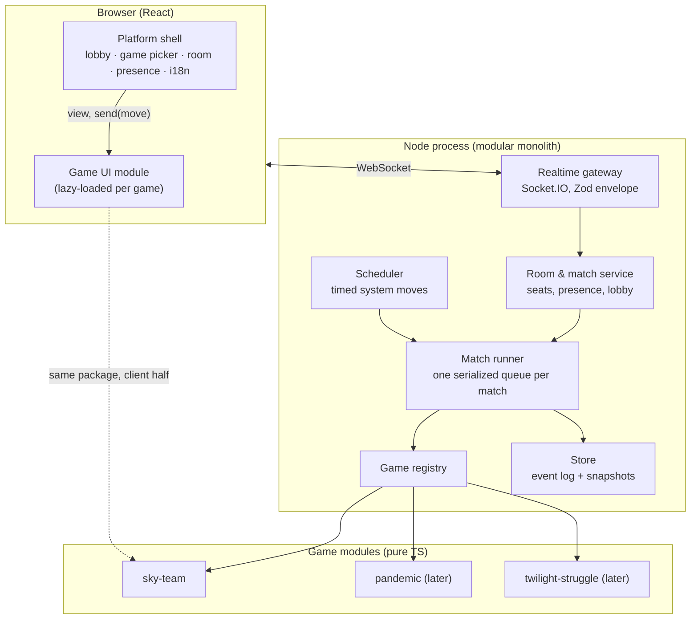

# Proposal: from Sky Team Online to a multi-game platform

**Status: draft for discussion (Oct 4, 2026).** Nothing here is decided. The [open questions](#11-open-questions) at the end shape the final design.

## 1. Context

Today the app does one thing well: two players fly Sky Team. The rules are pure functions in `packages/shared`, the server is the referee, and `viewFor` is the only way state leaves the server. Those three ideas carry over to any board game. What does not carry over is that **Sky Team is woven into every layer**:

| Layer | Sky Team assumptions today |
| --- | --- |
| Protocol (`events.ts`) | `game:place`, `game:reroll`, `game:ability`, … one event per Sky Team action; `Seat = 'pilot' \| 'copilot'`; `PlayerInfo` carries `pick`, `rolesChosen`, `ready` |
| Rooms (`rooms.ts`) | exactly two seats; `Room.game: GameState`; `timed`, `autoRollAt`, `roundTimer`, ability picks and role choice live on the room |
| Handlers (`handlers.ts`) | one handler per Sky Team action, calling Sky Team rule functions |
| Client store | `selectedDieId`, `coffeeDelta`, `internSlot`, `rerollPick`, `nextTurnAt` next to `connection` and `session` |
| Client screens | the lobby shows the scenario picker; `Game.tsx` is the cockpit |

The goal is a **game-agnostic platform** (accounts, lobby, rooms, seats, presence, reconnection, timers, persistence, history) that hosts **pluggable game modules**, starting with Sky Team and later games such as Pandemic, Isle of Skye and Twilight Struggle. The platform should scale from one small server to several.

## 2. What the target games demand

Designing for Sky Team alone would bake in its quirks. These four games stretch the model in different directions:

| Need | Sky Team | Pandemic | Isle of Skye | Twilight Struggle |
| --- | --- | --- | --- | --- |
| Players | 2 | 2–4 | 2–5 | 2 |
| Mode | co-op | co-op | competitive | competitive |
| Hidden info | partner's dice | deck order (hands are open) | bag draw, secret prices | hands, deck |
| Who acts | alternating, plus setup moves by both | one active player, plus event cards out of turn | **simultaneous** secret pricing, then turns | one active player, with **prompts** to the opponent (headlines, events) |
| Randomness | dice | shuffles | bag draws | shuffles, dice |
| Length | 15 min | 45 min | 60 min | **2–3 h** (needs save/resume, maybe async play) |
| Timers | optional round timer, auto-roll | none | none | optional chess clock |

The engine therefore needs:

1. **N seats** with game-defined names (pilot/co-pilot, Medic/Scientist, USA/USSR).
2. **An "who may act now" model** that covers turns, simultaneous secret commits and out-of-turn prompts.
3. **Per-viewer views**, including spectators, and server-only randomness.
4. **Scheduled server moves** (timers, auto-rolls) expressed as data, so they survive restarts.
5. **Persistence and replay** as a core feature, not an add-on (Twilight Struggle games outlive a deploy).
6. **Versioned rules**, so a game saved under v1 rules can still load after v2 ships.

## 3. Architecture principles

These keep today's principles and make them general:

1. **The server is the referee.** Clients send *moves* (intents); the game module validates and applies them.
2. **A game is a pure, deterministic reducer.** `(state, move, ctx) → state`, with RNG state inside the game state (as now). No I/O, no clocks, no `Math.random`.
3. **One exit per viewer.** `definition.view(state, viewer)` is the only way state leaves the server (today's `viewFor`).
4. **Everything is a move.** Player actions, setup choices ("ready", ability picks) and server events (timer expired, auto-roll) all go through `apply`. That makes replay, persistence and testing uniform.
5. **The platform never knows a game's rules,** and a game never knows about sockets, rooms or storage.
6. **Modular monolith first.** One deployable with strong internal boundaries. Split into services only when measurements demand it.

## 4. Target architecture



### 4.1 The game contract (`@platform/engine`)

The heart of the design is one interface. Every game implements it; the platform depends only on it.

```ts
/** A board game the platform can host. S = state, M = move, V = view, C = setup config. */
export interface GameDefinition<S, M, V, C> {
  id: string;                         // 'sky-team'
  version: number;                    // rules version, bumped on breaking changes
  meta: {
    seats: readonly string[];         // ['pilot', 'copilot'] or ['p1'..'p4']
    minPlayers: number;
    maxPlayers: number;
    mode: 'coop' | 'competitive';
  };

  configSchema: ZodType<C>;           // scenario, timer, expansions…
  moveSchema: ZodType<M>;             // every move a client may send

  setup(ctx: { config: C; seats: SeatId[]; seed: number }): S;

  /** Who may send which moves now (turn, simultaneous commit, prompt). */
  actors(state: S): Actor[];

  /** Pure validation; also usable on the client against a view when the game allows. */
  validate(state: S, move: M, by: SeatId | 'system'): Result<void, string>;

  /** Pure, deterministic. Randomness only from the RNG stored in S. */
  apply(state: S, move: M, by: SeatId | 'system'): S;

  /** The only exit: what one seat (or a spectator) may see. */
  view(state: S, viewer: SeatId | 'spectator'): V;

  /** Moves the server must make later: timeouts, auto-rolls, end-of-round pauses. */
  schedule?(state: S): ScheduledMove<M>[];   // [{ at: 'phase-start' + ms, move }]

  outcome(state: S): Outcome | null;   // null while playing; win/loss/scores when over

  /** Upgrades a saved state from an older rules version. */
  migrate?(state: unknown, fromVersion: number): S;
}

type Actor =
  | { seat: SeatId; kind: 'turn' }
  | { seat: SeatId; kind: 'simultaneous'; committed: boolean }
  | { seat: SeatId; kind: 'prompt'; prompt: string };
```

Why these choices:

- **`actors`** replaces the hard-coded `currentSeat`. Isle of Skye's secret pricing is `simultaneous` for every seat; a Twilight Struggle event asking the opponent to discard is a `prompt`.
- **`schedule`** turns today's `syncRoundTimer`, `scheduleAutoRoll` and `NEXT_TURN_MS` handling into data. The platform's scheduler arms timers from it, re-arms them after a restart, and sends the move as `'system'`.
- **`moveSchema` per game** keeps the "Zod for every incoming payload" rule with one generic envelope, instead of one event per action.
- **`validate` on views** generalizes `canPlaceInView`: a game opts in when its view holds enough information to highlight legal moves.

### 4.2 Generic protocol

Two families of events, with the game's payload typed by generics:

```ts
// Platform: unchanged in spirit from today.
'room:create'  { game: 'sky-team', config: unknown }   // config checked by configSchema
'room:join' | 'room:rejoin' | 'room:leave' | 'room:choose-seat'
'room:presence' { seats: Record<SeatId, PlayerInfo | null>, you?: SeatId }

// Game: one envelope for every game.
'match:move' { matchId, seq: number, move: unknown }  → ack { ok } | { ok: false, error }
'match:view' { matchId, version: number, view: V }
```

- `seq` is the client's move counter. A repeated `seq` is a no-op, which generalizes today's "duplicate `game:place` is harmless" rule.
- `version` is the match's move count, so a client drops stale views and can ask for a resync.
- `PlayerInfo` keeps only platform facts (`name`, `online`, `creator`). Game facts such as `pick`, `ready` and `confirmed` move into the game's state and view.

### 4.3 Server modules

| Module | Responsibility | Today |
| --- | --- | --- |
| **Gateway** | Socket.IO, auth token, Zod envelope, rate limits, per-IP caps | part of `handlers.ts` |
| **Room service** | lobby, room codes, seats, presence, reconnection tokens, sweeping idle rooms | `rooms.ts` minus game fields |
| **Match runner** | owns a match's state; serializes moves through one queue per match; calls `validate` → `apply` → `view` for each seat; broadcasts; appends to the log | spread across handlers |
| **Scheduler** | arms timers from `schedule(state)`, sends system moves, re-arms on load | `syncRoundTimer`, `scheduleAutoRoll` |
| **Game registry** | `Map<gameId, GameDefinition>`; lists games for the lobby | `SCENARIOS` lookup |
| **Store** | event log + snapshots behind an interface (`MatchStore`), in-memory for tests | Phase 11 plan (`RoomStore`) |

Per-match serialization (an actor or mailbox per match) is what makes scaling safe later: there is exactly one writer per match, wherever it runs.

### 4.4 Persistence: event sourcing with snapshots

Because every change is a move and `apply` is deterministic:

```
matches(id, game_id, rules_version, config jsonb, seed, status, created_at, ended_at)
match_seats(match_id, seat, user_id | guest_name, token_hash)
match_moves(match_id, n, by, move jsonb, at)          -- append-only log
match_snapshots(match_id, n, state jsonb)             -- every ~50 moves and at game end
```

- **Load** = latest snapshot + replay of the later moves.
- **Replay and history** (Phase 18) fall out for free: the Flight Log reads `matches` and `outcome`.
- **Debugging**: a bug report is a match id; replay it locally with the exact seed.
- **Rules upgrades**: a match records `rules_version`; `migrate` upgrades old snapshots, or old matches finish on the old version.

**Storage recommendation:** with several games, accounts and history coming, prefer **PostgreSQL** over the SQLite-or-Redis choice in Phase 11. JSONB fits states and moves, Railway and Fly offer managed Postgres, and it supports several app instances later. SQLite stays a fine choice if the platform remains a single instance; the `MatchStore` interface keeps that choice reversible.

### 4.5 Client architecture

```
apps/web (platform shell)
  ├── lobby: game picker → per-game setup form (from the game's client module)
  ├── room: seats, presence, invite link, reconnection, toasts, language
  └── <GameHost matchId>: loads the game's UI with React.lazy, passes props

games/<id>/client (one per game)
  export const client: GameClientModule<V, M, C> = {
    Board,        // ({ view, seat, send, pending }) => JSX
    SetupForm,    // the lobby options (scenario, timer…)
    Summary,      // the game-over / history card
    locales,      // i18n namespace: { en, vi }
  };
```

- **Store split:** the platform store keeps `connection`, `session`, `presence` and the latest `view` per match. UI state that belongs to one game (`selectedDieId`, `coffeeDelta`, `internSlot`, `rerollPick`) moves into that game's own Zustand slice.
- **Design system:** Tailwind tokens and shadcn components shared by every game, so a new game starts from the same look.
- **i18n:** one namespace per game (`sky-team:cockpit.radio`), plus a platform namespace for lobby and room text. Today's `en.json`/`vi.json` split along those lines.
- **Bundles:** each game's UI is a lazy chunk, so adding games does not slow the first load.
- **Routing:** today there is no router. `App.tsx` picks the screen from the store, and the only URL is the `/r/CODE` invite link (`codeFromPath`, `setUrl` with `history.replaceState`). With several games, the platform has real pages, so add **TanStack Router** (typed routes and search parameters, per-route lazy loading, works with Vite without server rendering). React Router v7 is the safe alternative. The store keeps the live connection and views; the router only decides which page shows. Proposed routes:

  ```
  /                      game picker
  /play/:gameId          setup and create (scenario, timer…)
  /r/:code               join or rejoin a room (keeps existing invite links)
  /m/:matchId            the match (board)
  /history               match history (the Flight Log)
  /u/:userId             profile (with accounts)
  ```

  The server's "any HTML GET returns `index.html`" fallback already supports these paths.

### 4.6 Repository layout

```
packages/
  engine/            GameDefinition, RNG, Result, test kit (fuzzer, leak check, replay)
  protocol/          envelope types + Zod for room:* and match:*
  server/            gateway, rooms, match runner, scheduler, store, registry
  web/               platform shell (React)
  ui/                design system: Tailwind theme, shadcn components
games/
  sky-team/
    rules/           today's packages/shared (createGame, placeDie, modules, scenarios…)
    client/          today's cockpit, tray, tracks, preflight, svgs
    test/            rules tests, random play
  <next-game>/
```

The **engine test kit** generalizes what Sky Team already has (`random-play`, view-leak checks in integration tests). Every game gets these checks for free:

- random games never throw;
- `apply` is deterministic for the same seed;
- no view leaks hidden fields (seeded per game with a `secret` list);
- every state survives a JSON round trip (so it can be persisted).

## 5. Scaling path

Scale in stages, each triggered by a measurement rather than a guess.

| Stage | Trigger | Shape |
| --- | --- | --- |
| **1. Modular monolith** (target of this refactor) | now | one Node process, all games in-process, Postgres (or SQLite) store; matches survive restarts |
| **2. Several instances** | one process can't hold the load, or zero-downtime deploys are wanted | N identical instances behind a load balancer; **each match owned by one instance** (lease in Redis, or routing by match id); Socket.IO Redis adapter for room fan-out; an instance dying → another loads the match from the store |
| **3. Split heavy work** | bots or AI analysis eat CPU | bot players as separate workers that connect as clients; stateless services (accounts, history API) separate from the realtime tier |

Sizing note: a board-game match is tiny (kilobytes of state, a move every few seconds), so one modest Node process can host thousands of concurrent matches. Expect stage 1 to last a long time. Correctness under restarts and deploys matters far more than raw throughput.

## 6. Cross-cutting concerns

- **Identity:** guest seats with tokens (as now) stay first-class; accounts (Phase 18) attach a user id to a seat. Spectators need no seat.
- **Security:** Zod envelope plus each game's `moveSchema`; per-IP room caps and rate limits in the gateway; `E2E_HOOKS`-style test hooks stay test-only.
- **Observability:** structured logs keyed by `matchId`; metrics for active matches, moves per second, reconnects, and validation rejections per game.
- **Licensing:** Pandemic, Isle of Skye and Twilight Struggle (like Sky Team) are published, trademarked games. Hosting them publicly needs the publishers' permission; a private, invite-only deployment for friends is a different risk level than a public site. This affects whether a public launch (Phase 12) includes these games.

## 7. Migration plan (each step ships, Sky Team keeps working)

| Step | Phase | Work | Risk |
| --- | --- | --- | --- |
| **A. Engine contract** | 13 | create `packages/engine`; wrap today's Sky Team rules in a `GameDefinition` adapter (`setup = createGame`, `apply` = dispatch over a move union, `view = viewFor`) | low: an adapter, no rule changes |
| **B. Moves for everything** | 14 | turn `ready`, `pick-ability`, `confirm`, round-timer expiry and Total Trust's auto-roll into moves and `schedule` entries; take `timed`, `autoRollAt`, `rolesChosen`, `pick` and `confirmed` off `Room` and into game state | medium: touches timers; existing tests catch regressions |
| **C. Generic protocol** | 15 | replace the `game:*` events with `match:move` / `match:view`; client and server switch in one release | medium |
| **D. Persistence** | 16 | Phase 11's store turned into the event log + snapshots behind `MatchStore` | medium |
| **E. Client split** | 17 | platform shell + `games/sky-team/client`; router (TanStack Router, routes in 4.5) with a game picker page; i18n namespaces; game-specific UI state into a game slice | medium: mostly moving files (the recent refactor already grouped cockpit and tray) |
| **F. Second game** | 19 | a small game first (e.g. a simple simultaneous-reveal card game) to prove simultaneous moves and N seats before investing in a large game | low |
| **G. Big games** | 21+ | Pandemic (N seats, out-of-turn events), then Twilight Struggle (prompts, long games, maybe async play) | high: rules size, not architecture |
| **H. Scale-out** | 20 | stage 2 above, only when metrics ask for it | medium |

Steps A–E are a refactor of the existing app. Steps F–G add product. Accounts (Phase 18) sit between them. Order decided Oct 4, 2026: Sky Team is finished and deployed first (Phases 10–12), so Phase 11's store is reworked into the match log in Phase 16; keeping it behind an interface keeps that rework small.

## 8. What changes in the project rules (CLAUDE.md)

- "All game rules live in `packages/shared`" becomes "each game's rules live in `games/<id>/rules` and implement `GameDefinition`".
- "`viewFor` is the only exit" becomes "`definition.view` is the only exit".
- "Clients send intents only (`game:place …`)" becomes "clients send `match:move` with a move the game's `moveSchema` accepts".
- "Game state is in memory for v1" is replaced by the store from step D.
- The Sky Team UI rules stay as they are, scoped to `games/sky-team/client`.

## 9. Trade-offs considered

- **Use an existing framework (boardgame.io, Colyseus)?** boardgame.io already offers moves, phases, per-player views and multiplayer. It would save work, but it is less actively maintained, and its turn model would need bending for Sky Team's silence rules and timers. Colyseus solves rooms and scaling but not rules. Recommendation: **keep our own small engine** (the contract above is about 200 lines), and borrow ideas from both.
- **Event sourcing vs. saving whole states:** saving whole states is simpler, but loses replay and history. The log costs little because moves are small.
- **Microservices now?** No: one team, small payloads, and a single process covers far more traffic than expected. Clear module boundaries keep the later split cheap.

## 10. Risks

| Risk | Mitigation |
| --- | --- |
| Abstraction shaped by one game | design against all four games' needs (section 2); prove it with a small second game before a big one |
| Big-bang rewrite stalls the app | steps A–E each ship with all current tests green |
| Rules changes break saved matches | `rules_version` per match, `migrate`, or finish old matches on old rules |
| Long games (Twilight Struggle) | persistence first; async play and notifications as a later option |
| Publisher IP | private deployment, or licenses / original games for a public launch |

## 11. Open questions

1. **Public or private?** A public site with published games needs licences; a private, invite-only site changes priorities (accounts, moderation, scale).
2. **Async play?** Should long games such as Twilight Struggle be playable over days (move, close the tab, get notified)? That favours the event log and adds notifications.
3. **Accounts:** required for every player, or guests plus optional accounts (as planned in Phase 18)?
4. **Bots:** will any game need computer players (solo Pandemic, practice Twilight Struggle)? That decides whether stage 3 matters.
5. **Storage:** Postgres (recommended for several games and history) or SQLite on one instance?
6. **Second game:** which small game should prove the engine before the big ones?
7. ~~**Order:**~~ Settled Oct 4, 2026: finish Sky Team first (Phases 10–12), then the platform phases 13–21, numbered in execution order.
