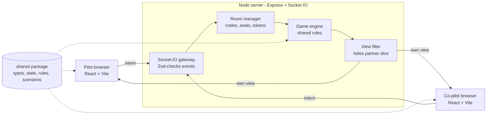

# Architecture

[← Master plan](../PLAN.md)

One Node process serves the built React app and runs Socket.IO; both sides import the same `shared` package, so rules are written once.

**Key principle:** never trust the client. The browser only sends intents ("place die 2 on the axis slot"); the server checks the rules and broadcasts the result.

## Stack

| Layer | Choice | Why |
| --- | --- | --- |
| Language | TypeScript (strict) everywhere | Shared types catch rule and protocol bugs |
| Monorepo | pnpm workspaces | One repo, `shared` imported by both sides |
| Server | Node 20+, Express, Socket.IO | Rooms, acks and reconnection built in |
| Client | React + Vite, Tailwind CSS v4 | Fast dev server, simple static build |
| UI components | shadcn/ui (lobby, dialogs, toasts, popover, select) | Accessible pieces copied into the repo; the board stays custom |
| Client state | Zustand | Holds the latest server view plus UI-only state |
| Validation | Zod | Checks every incoming socket payload |
| Tests | Vitest (+ fast-check), React Testing Library, Playwright | Same runner for shared, server and client; real browsers for E2E |
| Hosting | Fly.io, one machine with auto stop/start; SQLite on a volume + Litestream (decided Oct 4, 2026) | Long-running Node process with WebSockets; pay only while players are connected |

This is a personal/learning project: if it is ever published, use an original name and artwork rather than the publisher's.

## Data flow



Each move flows through the server, then each player receives their own filtered view.

**Saving rooms and matches (Sky Team 12, then Platform 04's match log):** a match is stored as a log, not as its latest state. `MatchStore` (`store.ts`; `SqliteMatchStore` on `better-sqlite3` through Drizzle, WAL mode, when `DATA_DIR` is set; `MemoryMatchStore` in tests) holds:

| Table | Holds |
| --- | --- |
| `rooms` | one JSON row per live room (`ROOM_FORMAT` 4): game id, players (name, seat, creator, last `seq`, a SHA-256 hash of the rejoin token), config, current match id / number / version |
| `matches` | one row per match: room code, game id, `rules_version`, config, seed, status (`open`, `over`, `abandoned`), created / ended times, outcome |
| `match_seats` | who sat in each seat (name, token hash, the account's `user_id` or NULL for a guest) |
| `match_moves` | every accepted change: `n` (the match's version after it), `by` (a seat or `system`), the move, `at` |
| `match_snapshots` | the state at `n`: after setup (`n` 0), every 50 changes, at the end, and for every open match on shutdown |

Every accepted change goes through `RoomManager.accept`, which applies it, bumps the version and appends it to `match_moves` before the broadcast. The room row is saved on the next tick. Loading a match is `restoreMatch`: the latest snapshot, then the moves after it replayed with the engine's `replay` (a match from an older `rules_version` goes through the game's `migrate` first; without one the room is dropped). Closing or sweeping a room deletes its row and marks an open match `abandoned`; matches stay for history and replay. On start, rooms load with every player offline, idle ones are swept, open matches no room points to are abandoned, and timers are re-armed. The schema is a list of SQL steps (`MIGRATIONS`, tracked in SQLite's `user_version`); format-3 room rows (Sky Team 12, the whole game inside) are converted into a room and a match on first start, so games in progress survive the upgrade.

## Repository layout

Since Platform 05: the platform in `packages/`, each game in `games/<id>/`.

```
boardgame/
├── package.json            # pnpm workspaces root (packages/*, games/*/*)
├── pnpm-workspace.yaml
├── tsconfig.base.json
├── packages/
│   ├── protocol/               # @platform/protocol: events, payload schemas, error codes
│   ├── engine/                 # @platform/engine: game-agnostic, no game code
│   │   └── src/
│   │       ├── index.ts        # GameDefinition contract, runDue, replay
│   │       ├── rng.ts          # seeded RNG (mulberry32) every game uses
│   │       └── testing.ts      # engine test kit (@platform/engine/testing)
│   ├── server/
│   │   └── src/
│   │       ├── index.ts        # Express + Socket.IO bootstrap
│   │       ├── games.ts        # game registry: definition, lobby schema, server settings
│   │       ├── rooms.ts        # rooms, matches, seq and versions, scheduler
│   │       ├── handlers.ts     # room:* and match:move, for every game
│   │       └── store.ts        # MatchStore: rooms + match log (SQLite / memory)
│   ├── ui/                     # @platform/ui: the client kit every game builds with
│   │   └── src/
│   │       ├── components/     # shadcn components (added here)
│   │       ├── theme.css       # Tailwind theme: fonts, colour tokens, dark mode, breakpoints
│   │       ├── i18n.ts         # the one i18next instance; addLocales(namespace, texts)
│   │       ├── locales/        # the platform namespace: en, vi, fr
│   │       ├── LanguageSwitch.tsx
│   │       ├── game.ts         # GameClientModule / PlatformApi contract
│   │       └── utils.ts        # cn
│   └── web/                    # @platform/web: the client shell (built and served)
│       └── src/
│           ├── main.tsx, App.tsx   # site password gate, then the router
│           ├── routes/         # file-based pages: __root, index (/), play.$gameId, r.$code
│           ├── routeTree.gen.ts # generated by the router plugin (committed)
│           ├── router.tsx      # the router from the generated tree; not-found → /
│           ├── ownRoom.ts      # toOwnRoom: a seated player is sent to their room
│           ├── games.ts        # installed games; lazy module loading (useGameModule)
│           ├── api.ts          # socket events -> store; rooms, match:move, platformServices
│           ├── store.ts        # usePlatform: connection, session, match view, presence
│           ├── presence.ts     # partner offline / back / left / joined toasts
│           ├── session.ts      # saved seat token (with the game id), invite links
│           ├── index.css       # the one Tailwind entry: theme + every game's styles.css
│           └── screens/        # Picker, Play (a game's lobby), Room (+ waiting room),
│                               # SitePassword, Shell (card, name, join form, connecting)
├── games/
│   └── sky-team/
│       ├── rules/              # @sky/rules: the rules (createGame, placeDie, modules,
│       │   └── src/            # scenarios…), definition.ts (@sky/rules/definition),
│       │                       # events.ts (protocol aliases), random-play
│       └── client/             # @sky/client: Sky Team's UI, one lazy chunk
│           └── src/
│               ├── index.ts    # the GameClientModule (skyTeamClient)
│               ├── api.ts      # moves through the injected PlatformApi
│               ├── store.ts    # useSkyTeam: selection, coffee, intern, rerolls, timers, Flight Log
│               ├── i18n.ts, locales/   # the sky-team namespace
│               ├── SetupForm.tsx, WaitingInfo.tsx
│               ├── screens/Game.tsx    # the Board
│               ├── components/ # cockpit/, tray/, Slot, Panel, StatusBar, Preflight,
│               │               # GameOverDialog, ScenarioPicker, FlightLog
│               ├── svgs/       # DieFace, FlightInstrument, tracks, WindRing, markers…
│               ├── lib/        # moves, setup, history, seat styles, small hooks
│               └── styles.css  # seat colours, cockpit and game grids, animations
├── e2e/                        # Playwright tests
└── .github/workflows/ci.yml
```

## Engine contract (Platform 01)

`packages/engine` defines what a game gives the platform: `GameDefinition<S, M, V, C>` with `configSchema` and `moveSchema` (Zod), `setup({ config, seats, host, seed, previous })`, `actors(state)` (who may act: a `turn`, a `simultaneous` choice or a `prompt`), `validate(state, move, { by, at })` and `apply(...)` (`by` is a seat or `'system'`), `view(state, viewer, now)`, `schedule(state)` (moves the platform must make later), `started(state)` (past the setup choices), `outcome(state)` and `migrate`. Every function is pure; nothing reads the clock but the caller.

Moves are checked and applied with a context `{ by, at }`: the platform stamps the time, so timers stay pure and replays exact. The platform tells a game about its table with two engine-defined system moves, `table:join` and `table:choose-seat` (the game says whether a seat change is still allowed; the platform then moves the players). `setup` gets the seats taken, the `host` and the `previous` game at the table, so a rematch or a restart can carry choices over. `runDue` makes the scheduled moves that are due, each at its own time.

Sky Team implements it in `games/sky-team/rules/src/definition.ts` (`skyTeam`, exported as `@sky/rules/definition` only, so the client bundle does not include it). Seat moves: `pick-ability`, `confirm`, `ready`, `place`, `spend-reroll`, `reroll`, `ability`, `cancel-swap`; the crew rules are in `crew.ts`, their state in `GameState.crew`. System moves: `roll` (Total Trust, at `autoRollAt`) and `time-up` (at the round's deadline), both from `schedule`; the second `ready` rolls the dice itself.

**Rooms (Platform 02):** `rooms.ts` knows only the engine and the registry (`games.ts`). A room holds the players (seat, name, token, socket, creator), the `config` it was set up with, the game state and one timer. `move(room, by, move)` validates and applies at the current time; `arm(room)` sets the timer for the earliest scheduled move, and when it fires `runDue` makes the due moves and `onScheduled` broadcasts. `broadcastRoom` saves and re-arms after every accepted change; on start every loaded room is armed (a deadline that passed while the server was down fires at once).

## Client shell (Platform 05)

The web package is a shell that knows games only through `GameClientModule` (`@platform/ui/game`):

- **Pages** (TanStack Router): `/` the game picker; `/play/:gameId` the game's lobby: name, join by code, the game's `SetupForm`, "Create a game"; `/r/:code` a room: the join form for an invite link, then (seated) connecting, the waiting room with the game's `WaitingInfo` while a seat is empty, then the game's `Board`. A seated player is redirected to their room; leaving goes back to `/play/<game>`.
- **Loading:** `games.ts` lists the installed games; `loadGame(id)` imports a game's module once (a separate chunk, `assets/<game>-*.js`), registers its texts (`addLocales`) and hands it the shell's services (`connect(platformServices)`). The picker and the password page load no game code.
- **State:** `usePlatform` (the shell) holds the connection, the session (with the game id), the latest `match:view` envelope and presence. Each game has its own store; the shell calls the module's `onView(view, before, presence)` before showing a new view, and `reset()` when the player leaves.
- **Services:** a game sends moves with `platform.send(move)` (the shell adds the match id and `seq`, and shows refusals through the game's `errorText` or its own), and asks for `chooseSeat`, `rematch`, `leave`.
- **Texts:** one i18next instance in `@platform/ui/i18n`: the `platform` namespace (default) for the shell, one per game.
- **Styles:** `packages/web/src/index.css` is the single Tailwind entry: the kit's `theme.css`, each game's `styles.css`, and `@source` for the kit and each game.

## Server handler pattern

**Protocol (Platform 03):** `packages/protocol` is the wire format for every game (see [protocol.md](protocol.md)): `room:*` events for the platform, `match:move` / `match:view` for games. A room plays one match at a time (`room.match`: id `<code>-<n>`, number, version); `version` counts accepted changes and rides on every view; each player keeps the last `seq` accepted from them, so a resend is a no-op. The registry (`games.ts`) gives each game id its definition, lobby schema and server settings.

`onSeated` in `handlers.ts`: parse the payload with the protocol's schema → find the socket's seat → make the due scheduled moves → for `match:move`, check the match id and the game's `moveSchema`, then `rooms.play` (the `seq` check, then the game validates and applies; rules resolve axis, engines, the end of the round and landing) → `broadcastRoom` saves, re-arms the timer and sends presence and each seat's `match:view`. Any failure returns `{ ok: false, error }` and changes nothing. The handlers import no game code; the one Sky Team-specific route left is the test-only `POST /__e2e/rooms/:code/game` in `app.ts`.

## Scaling later

More than one server instance needs a shared store (Redis) for game state, the Socket.IO Redis adapter and sticky sessions. Not needed while one instance serves everyone (see [Sky Team 12](../epics/sky-team/phase-12-persistence.md) and, for several instances, [Platform 07](../epics/platform/phase-07-scale-out.md)).
