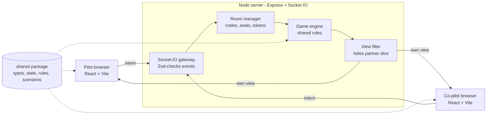

# Architecture

[← Master plan](../PLAN.md)

One Node process serves the built React app and runs Socket.IO; both sides import the same `shared` package, so rules are written once.

**Key principle:** never trust the client. The browser only sends intents ("place die 2 on the axis slot"); the server checks the rules and broadcasts the result.

## Stack

| Layer | Choice | Why |
| --- | --- | --- |
| Language | TypeScript (strict) everywhere | Shared types catch rule and protocol bugs |
| Monorepo | pnpm workspaces | One repo, `shared` imported by both sides |
| Server | Node 20+, Express, Socket.IO | Rooms, acks and reconnection built in |
| Client | React + Vite, Tailwind CSS v4 | Fast dev server, simple static build |
| UI components | shadcn/ui (lobby, dialogs, toasts, popover, select) | Accessible pieces copied into the repo; the board stays custom |
| Client state | Zustand | Holds the latest server view plus UI-only state |
| Validation | Zod | Checks every incoming socket payload |
| Tests | Vitest (+ fast-check), React Testing Library, Playwright | Same runner for shared, server and client; real browsers for E2E |
| Hosting | Fly.io, one machine with auto stop/start; SQLite on a volume + Litestream (decided Oct 4, 2026) | Long-running Node process with WebSockets; pay only while players are connected |

This is a personal/learning project: if it is ever published, use an original name and artwork rather than the publisher's.

## Data flow



Each move flows through the server, then each player receives their own filtered view.

## Repository layout

```
boardgame/
├── package.json            # pnpm workspaces root
├── pnpm-workspace.yaml
├── tsconfig.base.json
├── packages/
│   ├── shared/
│   │   └── src/
│   │       ├── types.ts        # GameState, Seat, Slot, events
│   │       ├── state.ts        # createGame()
│   │       ├── rules.ts        # canPlaceDie, placeDie, endRound, checkLanding
│   │       ├── views.ts        # viewFor(state, seat)
│   │       ├── scenarios.ts    # airport configs as data
│   │       ├── modules/        # Flight Log modules as rule hooks
│   │       ├── abilities.ts    # Special Ability actions
│   │       └── rng.ts          # seedable dice roller
│   ├── server/
│   │   └── src/
│   │       ├── index.ts        # Express + Socket.IO bootstrap
│   │       ├── rooms.ts        # create/join/leave, cleanup
│   │       ├── handlers.ts     # socket event handlers
│   │       └── schemas.ts      # Zod payload schemas
│   └── client/
│       └── src/
│           ├── main.tsx
│           ├── socket.ts       # typed socket instance
│           ├── store.ts        # Zustand store for the view
│           ├── api.ts          # socket events → store; actions (create, join, place, …)
│           ├── session.ts      # saved seat token, invite links
│           ├── screens/        # Lobby (+ waiting room), Game
│           ├── lib/            # moves, setup, seat styles, shared classes, small hooks
│           ├── components/     # Panel, Slot, StatusBar, Preflight, GameOverDialog,
│           │   │               # ScenarioPicker (+ components/ui from shadcn)
│           │   ├── cockpit/    # Cockpit (dispatcher), layout (order + desktop grid),
│           │   │               # panels (base game), ModulePanels, Slots
│           │   └── tray/       # DiceTray (by phase): Strategy/Reroll/PlacingTray, DieButton,
│           │                   # notes, popovers, CoffeeControl, AbilityActions, text
│           └── svgs/           # one SVG drawing per file: DieFace, FlightInstrument,
│                               # AltitudeTrack, ApproachTrack, WindRing, markers, Plane,
│                               # InternBadge, Switch (+ geometry helpers)
├── e2e/                        # Playwright tests
└── .github/workflows/ci.yml
```

## Server handler pattern

`onSeated` in `handlers.ts`: parse the payload with Zod → find the socket's seat → check with the shared rules → apply (rules resolve axis, engines, the end of the round and landing) → `broadcastRoom` sends presence and each seat's `viewFor`. Any failure returns `{ ok: false, error }` and changes nothing.

## Scaling later

More than one server instance needs a shared store (Redis) for game state, the Socket.IO Redis adapter and sticky sessions. Not needed while one instance serves everyone (see [Sky Team 12](../epics/sky-team/phase-12-persistence.md) and, for several instances, [Platform 07](../epics/platform/phase-07-scale-out.md)).
