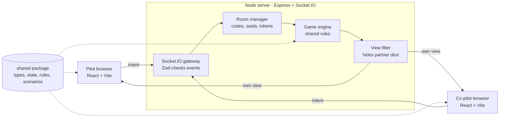

# Architecture

[← Master plan](../PLAN.md)

One Node process serves the built React app and runs Socket.IO; both sides import the same `shared` package, so rules are written once.

**Key principle:** never trust the client. The browser only sends intents ("place die 2 on the axis slot"); the server checks the rules and broadcasts the result.

## Stack

| Layer | Choice | Why |
| --- | --- | --- |
| Language | TypeScript (strict) everywhere | Shared types catch rule and protocol bugs |
| Monorepo | pnpm workspaces | One repo, `shared` imported by both sides |
| Server | Node 20+, Express, Socket.IO | Rooms, acks and reconnection built in |
| Client | React + Vite, Tailwind CSS v4 | Fast dev server, simple static build |
| UI components | shadcn/ui (lobby, dialogs, toasts, popover, select) | Accessible pieces copied into the repo; the board stays custom |
| Client state | Zustand | Holds the latest server view plus UI-only state |
| Validation | Zod | Checks every incoming socket payload |
| Tests | Vitest (+ fast-check), React Testing Library, Playwright | Same runner for shared, server and client; real browsers for E2E |
| Hosting | Fly.io, one machine with auto stop/start; SQLite on a volume + Litestream (decided Oct 4, 2026) | Long-running Node process with WebSockets; pay only while players are connected |

This is a personal/learning project: if it is ever published, use an original name and artwork rather than the publisher's.

## Data flow



Each move flows through the server, then each player receives their own filtered view.

**Saving rooms (Sky Team 12):** every accepted change ends in `broadcastRoom`, which also queues `rooms.save(room)`. On the next tick the room manager writes the changed rooms through its `RoomStore` (`store.ts`): `SqliteRoomStore` (Drizzle on `better-sqlite3`, WAL mode, one table `rooms(code, json, version, updated_at)`) when `DATA_DIR` is set, nothing otherwise; `MemoryRoomStore` in tests. A saved room holds the players (with rejoin tokens), the `GameState` and the room's own flags; socket ids and timers are never saved. On start the rooms load with every player offline, idle ones are swept, and their timers are re-armed. Rows saved in another `ROOM_FORMAT` are dropped. Shutdown (SIGINT/SIGTERM, as Fly sends when it stops the machine) flushes pending saves.

## Repository layout

```
boardgame/
├── package.json            # pnpm workspaces root
├── pnpm-workspace.yaml
├── tsconfig.base.json
├── packages/
│   ├── engine/                 # @platform/engine: game-agnostic, no Sky Team code
│   │   └── src/
│   │       ├── index.ts        # GameDefinition contract: Actor, Outcome, Result, ScheduledMove
│   │       ├── rng.ts          # seeded RNG (mulberry32) every game uses
│   │       └── testing.ts      # engine test kit (@platform/engine/testing)
│   ├── shared/
│   │   └── src/
│   │       ├── definition.ts   # Sky Team as a GameDefinition (@sky/shared/definition)
│   │       ├── types.ts        # GameState, Seat, Slot, events
│   │       ├── state.ts        # createGame()
│   │       ├── rules.ts        # canPlaceDie, placeDie, endRound, checkLanding
│   │       ├── views.ts        # viewFor(state, seat)
│   │       ├── scenarios.ts    # airport configs as data
│   │       ├── modules/        # Flight Log modules as rule hooks
│   │       ├── abilities.ts    # Special Ability actions
│   │       └── rng.ts          # Sky Team's die (rollDie) on the engine RNG
│   ├── server/
│   │   └── src/
│   │       ├── index.ts        # Express + Socket.IO bootstrap
│   │       ├── rooms.ts        # create/join/leave, cleanup
│   │       ├── handlers.ts     # socket event handlers
│   │       └── schemas.ts      # Zod payload schemas
│   └── client/
│       └── src/
│           ├── main.tsx
│           ├── socket.ts       # typed socket instance
│           ├── store.ts        # Zustand store for the view
│           ├── api.ts          # socket events → store; actions (create, join, place, …)
│           ├── session.ts      # saved seat token, invite links
│           ├── screens/        # Lobby (+ waiting room), Game
│           ├── lib/            # moves, setup, seat styles, shared classes, small hooks
│           ├── components/     # Panel, Slot, StatusBar, Preflight, GameOverDialog,
│           │   │               # ScenarioPicker (+ components/ui from shadcn)
│           │   ├── cockpit/    # Cockpit (dispatcher), layout (order + desktop grid),
│           │   │               # panels (base game), ModulePanels, Slots
│           │   └── tray/       # DiceTray (by phase): Strategy/Reroll/PlacingTray, DieButton,
│           │                   # notes, popovers, CoffeeControl, AbilityActions, text
│           └── svgs/           # one SVG drawing per file: DieFace, FlightInstrument,
│                               # AltitudeTrack, ApproachTrack, WindRing, markers, Plane,
│                               # InternBadge, Switch (+ geometry helpers)
├── e2e/                        # Playwright tests
└── .github/workflows/ci.yml
```

## Engine contract (Platform 01)

`packages/engine` defines what a game gives the platform: `GameDefinition<S, M, V, C>` with `configSchema` and `moveSchema` (Zod), `setup({ config, seats, seed })`, `actors(state)` (who may act: a `turn`, a `simultaneous` choice or a `prompt`), `validate(state, move, by)` and `apply(state, move, by)` (`by` is a seat or `'system'`), `view(state, viewer, now)`, `schedule(state)` (moves the platform must make later), `outcome(state)` and `migrate`. Every function is pure; moves carry their time (`at`), so nothing reads the clock but the caller.

Moves are checked and applied with a context `{ by, at }`: the platform stamps the time, so timers stay pure and replays exact. The platform tells a game about its table with two engine-defined system moves, `table:join` and `table:choose-seat` (the game says whether a seat change is still allowed; the platform then moves the players). `setup` gets the seats taken, the `host` and the `previous` game at the table, so a rematch or a restart can carry choices over. `runDue` makes the scheduled moves that are due, each at its own time.

Sky Team implements it in `packages/shared/src/definition.ts` (`skyTeam`, exported as `@sky/shared/definition` only, so the client bundle does not include it). Seat moves: `pick-ability`, `confirm`, `ready`, `place`, `spend-reroll`, `reroll`, `ability`, `cancel-swap`; the crew rules are in `crew.ts`, their state in `GameState.crew`. System moves: `roll` (Total Trust, at `autoRollAt`) and `time-up` (at the round's deadline), both from `schedule`; the second `ready` rolls the dice itself.

**Rooms (Platform 02):** `rooms.ts` knows only the engine and the registry (`games.ts`). A room holds the players (seat, name, token, socket, creator), the `config` it was set up with, the game state and one timer. `move(room, by, move)` validates and applies at the current time; `arm(room)` sets the timer for the earliest scheduled move, and when it fires `runDue` makes the due moves and `onScheduled` broadcasts. `broadcastRoom` saves and re-arms after every accepted change; on start every loaded room is armed (a deadline that passed while the server was down fires at once).

## Server handler pattern

`onSeated` in `handlers.ts`: parse the payload (game events: `{ type, ...payload }` through the game's `moveSchema`) → find the socket's seat → make the due scheduled moves → `rooms.move` (the game validates and applies; rules resolve axis, engines, the end of the round and landing) → `broadcastRoom` saves, re-arms the timer and sends presence and each seat's view. Any failure returns `{ ok: false, error }` and changes nothing. The handlers still speak the Sky Team protocol (events per action, the lobby's `timer` and `scenario` turned into the game's config) until Platform 03.

## Scaling later

More than one server instance needs a shared store (Redis) for game state, the Socket.IO Redis adapter and sticky sessions. Not needed while one instance serves everyone (see [Sky Team 12](../epics/sky-team/phase-12-persistence.md) and, for several instances, [Platform 07](../epics/platform/phase-07-scale-out.md)).
